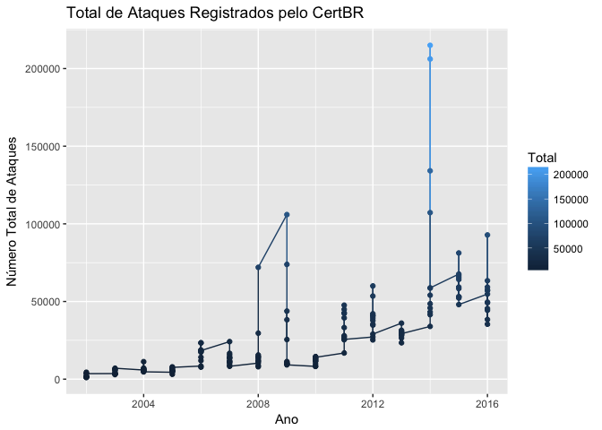
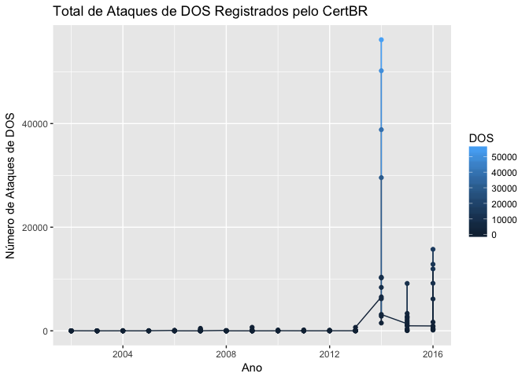

Untitled
================

``` r
knitr::opts_chunk$set(echo = TRUE)

### Bibliotecas
library(readr)
library(dplyr)
```

    ## 
    ## Attaching package: 'dplyr'

    ## The following objects are masked from 'package:stats':
    ## 
    ##     filter, lag

    ## The following objects are masked from 'package:base':
    ## 
    ##     intersect, setdiff, setequal, union

``` r
library(stringr)
library(tidyr)
library(ggplot2)
library(googleVis)
```

    ## Creating a generic function for 'toJSON' from package 'jsonlite' in package 'googleVis'

    ## 
    ## Welcome to googleVis version 0.6.2
    ## 
    ## Please read Google's Terms of Use
    ## before you start using the package:
    ## https://developers.google.com/terms/
    ## 
    ## Note, the plot method of googleVis will by default use
    ## the standard browser to display its output.
    ## 
    ## See the googleVis package vignettes for more details,
    ## or visit http://github.com/mages/googleVis.
    ## 
    ## To suppress this message use:
    ## suppressPackageStartupMessages(library(googleVis))

``` r
### Suprimindo mensagens de warning 
searchpaths()
```

    ##  [1] ".GlobalEnv"                                                              
    ##  [2] "/Library/Frameworks/R.framework/Versions/3.3/Resources/library/googleVis"
    ##  [3] "/Library/Frameworks/R.framework/Versions/3.3/Resources/library/ggplot2"  
    ##  [4] "/Library/Frameworks/R.framework/Versions/3.3/Resources/library/tidyr"    
    ##  [5] "/Library/Frameworks/R.framework/Versions/3.3/Resources/library/stringr"  
    ##  [6] "/Library/Frameworks/R.framework/Versions/3.3/Resources/library/dplyr"    
    ##  [7] "/Library/Frameworks/R.framework/Versions/3.3/Resources/library/readr"    
    ##  [8] "/Library/Frameworks/R.framework/Versions/3.3/Resources/library/stats"    
    ##  [9] "/Library/Frameworks/R.framework/Versions/3.3/Resources/library/graphics" 
    ## [10] "/Library/Frameworks/R.framework/Versions/3.3/Resources/library/grDevices"
    ## [11] "/Library/Frameworks/R.framework/Versions/3.3/Resources/library/utils"    
    ## [12] "/Library/Frameworks/R.framework/Versions/3.3/Resources/library/datasets" 
    ## [13] "/Library/Frameworks/R.framework/Versions/3.3/Resources/library/methods"  
    ## [14] "Autoloads"                                                               
    ## [15] "/Library/Frameworks/R.framework/Resources/library/base"

``` r
suppressMessages(library(dplyr))


### Consciência situacional
orig <- getwd()
orig
```

    ## [1] "/Users/sidneibarbieri/Documents/CAP386_Sidnei/Projeto"

``` r
setwd(orig)


file.exists("./CertBR.csv")
```

    ## [1] TRUE

``` r
file <- "./CertBR.csv"


tamanho <- file.info(file)$size
tamanho
```

    ## [1] 15258

``` r
### Importando o arquivo (https://www.cert.br/stats/incidentes/)
df<-read.csv2(file, header = TRUE, sep =";", dec=",", stringsAsFactors = FALSE, encoding = "UTF-8")
as.data.frame(df)
```

    ##     Ord Mes  Ano  Total  Worm Worm_P   DOS DOS_P Invasao Invasao_P   Web
    ## 1     1 jan 2016  54781  4994   9.12   942  1,72     272      0.50  2266
    ## 2     2 fev 2016  57041  4176   7.32   137  0,24      95      0.17  1422
    ## 3     3 mar 2016  92852  3886   4.19 12851 13,84     106      0.11  4526
    ## 4     4 abr 2016  44352  1170   2.64  6147 13,86     126      0.28  1637
    ## 5     5 mai 2016  49228  3186   6.47   338  0,69     125      0.25  2361
    ## 6     6 jun 2016  59266  2041   3.44   823  1,39     126      0.21  1554
    ## 7     7 jul 2016  38402  1766   4.60  1676  4,36     116      0.30  1804
    ## 8     8 ago 2016  49596  1927   3.89   260  0,52     137      0.28 10802
    ## 9     9 set 2016  45472  1583   3.48  9171 20,17     145      0.32  6027
    ## 10   10 out 2016  35372  1293   3.66   410  1,16      86      0.24  5050
    ## 11   11 nov 2016  57345  1018   1.78 15735 27,44     320      0.56  7758
    ## 12   12 dez 2016  63405  1208   1.91 11942 18,83      41      0.06 10234
    ## 13   13 jan 2015  67661  2829   4.18  1367  2,02     409      0.60  6547
    ## 14   14 fev 2015  66700  2682   4.02  2056  3,08     289      0.43  8102
    ## 15   15 mar 2015  52959  2867   5.41    70  0,13     489      0.92  8822
    ## 16   16 abr 2015  52991  3046   5.75    34  0,06     150      0.28  6297
    ## 17   17 mai 2015  58322  3122   5.35   374  0,64     177      0.30  5399
    ## 18   18 jun 2015  81244  3423   4.21  1016  1,25     157      0.19  9219
    ## 19   19 jul 2015  53075  4141   7.80  2763  5,21     160      0.30  4716
    ## 20   20 ago 2015  65486  3683   5.62  3354  5,12     104      0.16  4447
    ## 21   21 set 2015  59311  4326   7.29  2511  4,23     119      0.20  3993
    ## 22   22 out 2015  52226  6301  12.06  1702  3,26     140      0.27  4315
    ## 23   23 nov 2015  64203  5912   9.21  9142 14,24     145      0.23  2297
    ## 24   24 dez 2015  48027  5390  11.22   971  2,02     118      0.25  1493
    ## 25   25 jan 2014  33959  2853   8.40  6539 19,26     590      1.74  1267
    ## 26   26 fev 2014  43227  4163   9.63  6190 14,32     764      1.77  1434
    ## 27   27 mar 2014  45808  9238  20.17  2829  6,18     780      1.70  1253
    ## 28   28 abr 2014  41533  3513   8.46  1505  3,62    1559      3.75  1900
    ## 29   29 mai 2014  48565  2857   5.88  8383 17,26     293      0.60  1997
    ## 30   30 jun 2014  54057  2274   4.21 10345 19,14     612      1.13  2171
    ## 31   31 jul 2014  58662  3294   5.62 10218 17,42     210      0.36  2225
    ## 32   32 ago 2014 134156  3327   2.48 38822 28,94     187      0.14  1828
    ## 33   33 set 2014 214954  3312   1.54 56184 26,14     290      0.13  2347
    ## 34   34 out 2014 206148  2563   1.24 50195 24,35     296      0.14  3029
    ## 35   35 nov 2014 107219  2571   2.40 29566 27,58     201      0.19  3416
    ## 36   36 dez 2014  58743  2226   3.79  3159  5,38     727      1.24  5941
    ## 37   37 jan 2013  36067  2217   6.15    15  0,04    2149      5.96  1305
    ## 38   38 fev 2013  26471  1523   5.75     6  0,02    1206      4.56  1364
    ## 39   39 mar 2013  28090  1771   6.30     6  0,02    1686      6.00  1113
    ## 40   40 abr 2013  29943  2084   6.96    14  0,05    1511      5.05  1479
    ## 41   41 mai 2013  23409  1638   7.00     6  0,03     972      4.15  1349
    ## 42   42 jun 2013  29713  2580   8.68    15  0,05     592      1.99  2177
    ## 43   43 jul 2013  30874  2932   9.50   123   0,4     509      1.65  1710
    ## 44   44 ago 2013  28531  2090   7.33    24  0,08     542      1.90  1942
    ## 45   45 set 2013  31482  2365   7.51    86  0,27     419      1.33  1573
    ## 46   46 out 2013  28842  2847   9.87    34  0,12     741      2.57  1066
    ## 47   47 nov 2013  30213  2843   9.41    28  0,09     363      1.20  2247
    ## 48   48 dez 2013  29290  3089  10.55   673   2,3     517      1.77  1396
    ## 49   49 jan 2012  27148  6830  25.16     7  0,03     603      2.22  2137
    ## 50   50 fev 2012  25266  4404  17.43    34  0,13     452      1.79  2211
    ## 51   51 mar 2012  34796  2380   6.84    22  0,06     559      1.61  3508
    ## 52   52 abr 2012  35342  3171   8.97     9  0,03     100      0.28  2111
    ## 53   53 mai 2012  40965  3242   7.91    11  0,03     413      1.01  3532
    ## 54   54 jun 2012  37806  2702   7.15     9  0,02     619      1.64  3124
    ## 55   55 jul 2012  42104  2922   6.94    17  0,04    1320      3.14  2899
    ## 56   56 ago 2012  60018  2867   4.78    40  0,07     659      1.10  1717
    ## 57   57 set 2012  53501  3157   5.90     9  0,02    1043      1.95  1359
    ## 58   58 out 2012  39326  3380   8.59     9  0,02     754      1.92  1186
    ## 59   59 nov 2012  40751  1858   4.56   125  0,31     716      1.76  1116
    ## 60   60 dez 2012  29006  1553   5.35    17  0,06     577      1.99   657
    ## 61   61 jan 2011  16840  1041   6.18     9  0,05       6      0.04   996
    ## 62   62 fev 2011  26289   865   3.29     9  0,03       8      0.03   784
    ## 63   63 mar 2011  47630  1207   2.53    13  0,03      25      0.05  1005
    ## 64   64 abr 2011  44908  1157   2.58    10  0,02      12      0.03   901
    ## 65   65 mai 2011  42715  1038   2.43     2     -       5      0.01  1091
    ## 66   66 jun 2011  39458   933   2.36     2  0,01       2      0.01  1183
    ## 67   67 jul 2011  42262  1236   2.92    11  0,03      11      0.03  2697
    ## 68   68 ago 2011  33209  2161   6.51   170  0,51      10      0.03  1757
    ## 69   69 set 2011  25409  3518  13.85    31  0,12      10      0.04  1446
    ## 70   70 out 2011  27966  3903  13.96     3  0,01       5      0.02   856
    ## 71   71 nov 2011  27248  3624  13.30     3  0,01       6      0.02  1243
    ## 72   72 dez 2011  25581  6214  24.29     9  0,04       6      0.02  1532
    ## 73   73 jan 2010   8223  1467  17.84     5  0,06       1      0.01   402
    ## 74   74 fev 2010   8266  2170  26.25     5  0,06       5      0.06   470
    ## 75   75 mar 2010  11836  2236  18.89     -     -       1      0.01   780
    ## 76   76 abr 2010  11462  2127  18.56     -     -       3      0.03   522
    ## 77   77 mai 2010   9680  1310  13.53     3  0,03       7      0.07   653
    ## 78   78 jun 2010  11680  1324  11.34     2  0,02       2      0.02   706
    ## 79   79 jul 2010  12661  1150   9.08     -     -      22      0.17   986
    ## 80   80 ago 2010  14171  1213   8.56     4  0,03       5      0.04   928
    ## 81   81 set 2010  13177   904   6.86     -     -      11      0.08   734
    ## 82   82 out 2010  13078  1555  11.89     1  0,01      18      0.14   835
    ## 83   83 nov 2010  14551   991   6.81   157  1,08       9      0.06   825
    ## 84   84 dez 2010  14059  1181   8.40    21  0,15       5      0.04   871
    ## 85   85 jan 2009 105945 26748  25.25     -     -      13      0.01   364
    ## 86   86 fev 2009  73883  3524   4.77     3     -       5      0.01   457
    ## 87   87 mar 2009  38246   773   2.02     3  0,01      12      0.03   342
    ## 88   88 abr 2009  25496   468   1.84   682  2,67      20      0.08   579
    ## 89   89 mai 2009  43819  1212   2.77     2     -      27      0.06   431
    ## 90   90 jun 2009  10792  1821  16.87     1  0,01       4      0.04   464
    ## 91   91 jul 2009   9831  2073  21.09   191  1,94       5      0.05   565
    ## 92   92 ago 2009   9783  2233  22.83     2  0,02       4      0.04   458
    ## 93   93 set 2009   9810  1706  17.39     1  0,01       7      0.07   474
    ## 94   94 out 2009  11342  1483  13.08     -     -       7      0.06   336
    ## 95   95 nov 2009  10183  1674  16.44    10   0,1       5      0.05   560
    ## 96   96 dez 2009   9213  1384  15.02     1  0,01       2      0.02   562
    ## 97   97 jan 2008  10341  3164  30.60    73  0,71      13      0.13   343
    ## 98   98 fev 2008   7996  2200  27.51     2  0,03       4      0.05   258
    ## 99   99 mar 2008  11586  2579  22.26     4  0,03      25      0.22   420
    ## 100 100 abr 2008  14333  1883  13.14     3  0,02       5      0.03   329
    ## 101 101 mai 2008  14567  2760  18.95     7  0,05     133      0.91   624
    ## 102 102 jun 2008  15561  2690  17.29     1  0,01      27      0.17   332
    ## 103 103 jul 2008  13735  1806  13.15     2  0,01      20      0.15   232
    ## 104 104 ago 2008  11488  1859  16.18     -     -      19      0.17   530
    ## 105 105 set 2008   8686  1619  18.64     5  0,06      36      0.41   262
    ## 106 106 out 2008  12652  1496  11.82     -     -      13      0.10   238
    ## 107 107 nov 2008  29599  2288   7.73     -     -      20      0.07   237
    ## 108 108 dez 2008  71984  8616  11.97     3     -      12      0.02   396
    ## 109 109 jan 2007  24181 18109  74.89     -     -       8      0.03    21
    ## 110 110 fev 2007  15482  9302  60.08     -     -       4      0.03    19
    ## 111 111 mar 2007  16633  9124  54.85     1  0,01       3      0.02   125
    ## 112 112 abr 2007  14152  6416  45.34    11  0,08       6      0.04   147
    ## 113 113 mai 2007  13623  5776  42.40   179  1,31       5      0.04   139
    ## 114 114 jun 2007  10738  4621  43.03     8  0,07      15      0.14   121
    ## 115 115 jul 2007  10858  4349  40.05     2  0,02      18      0.17    88
    ## 116 116 ago 2007  11437  4831  42.24     -     -       2      0.02   114
    ## 117 117 set 2007  11906  4620  38.80   480  4,03      33      0.28   152
    ## 118 118 out 2007  13644  3535  25.91   260  1,91     110      0.81   192
    ## 119 119 nov 2007   9152  3674  40.14     -     -      43      0.47   200
    ## 120 120 dez 2007   8274  3116  37.66    13  0,16      11      0.13   371
    ## 121 121 jan 2006   8446  1358  16.08    71  0,84      24      0.28    32
    ## 122 122 fev 2006   7742  1223  15.80    33  0,43      59      0.76    54
    ## 123 123 mar 2006  11945  4062  34.01    41  0,34     112      0.94    29
    ## 124 124 abr 2006  14126  7327  51.87     3  0,02      61      0.43    28
    ## 125 125 mai 2006  18204 11139  61.19    81  0,44      24      0.13    29
    ## 126 126 jun 2006  17470 11036  63.17    24  0,14      44      0.25    43
    ## 127 127 jul 2006  18754 12833  68.43    11  0,06      57      0.30    46
    ## 128 128 ago 2006  17501  8961  51.20     4  0,02      44      0.25    37
    ## 129 129 set 2006  23321 13499  57.88     4  0,02      26      0.11    38
    ## 130 130 out 2006  18592  8944  48.11     3  0,02      21      0.11    35
    ## 131 131 nov 2006  23414 16355  69.85     -     -      43      0.18    51
    ## 132 132 dez 2006  18377 12939  70.41     2  0,01       8      0.04    27
    ## 133 133 jan 2005   4448  1019  22.91     -     -      14      0.31    22
    ## 134 134 fev 2005   3142  1157  36.82     1  0,03      27      0.86    57
    ## 135 135 mar 2005   4848  1906  39.32     2  0,04      42      0.87    24
    ## 136 136 abr 2005   5253  1432  27.26     -     -      20      0.38    25
    ## 137 137 mai 2005   6883  2175  31.60     2  0,03      34      0.49    22
    ## 138 138 jun 2005   5406  1510  27.93     5  0,09      17      0.31    55
    ## 139 139 jul 2005   5146  1329  25.83     2  0,04      15      0.29    22
    ## 140 140 ago 2005   5718  1144  20.01     5  0,09      45      0.79    41
    ## 141 141 set 2005   5361  1075  20.05     2  0,04      87      1.62    64
    ## 142 142 out 2005   6316  1220  19.32    13  0,21      66      1.04    62
    ## 143 143 nov 2005   7901  1484  18.78    45  0,57      43      0.54   122
    ## 144 144 dez 2005   7578  1881  24.82    19  0,25      38      0.50    54
    ## 145 145 jan 2004   5886  3013  51.19     6   0,1       9      0.15    55
    ## 146 146 fev 2004   6110  2306  37.74     4  0,07      13      0.21    22
    ## 147 147 mar 2004   6002  2653  44.20    19  0,32      56      0.93    32
    ## 148 148 abr 2004   4763  2496  52.40     2  0,04      14      0.29    81
    ## 149 149 mai 2004   5471  2260  41.31     2  0,04      19      0.35    58
    ## 150 150 jun 2004   6502  3752  57.71     3  0,05       6      0.09    26
    ## 151 151 jul 2004   6773  4636  68.45     2  0,03       7      0.10    49
    ## 152 152 ago 2004   5910  3221  54.50     5  0,08      22      0.37    71
    ## 153 153 set 2004   5167  2997  58.00     4  0,08      13      0.25    52
    ## 154 154 out 2004  11253  8821  78.39    51  0,45      13      0.12    29
    ## 155 155 nov 2004   7149  4599  64.33     1  0,01      40      0.56    39
    ## 156 156 dez 2004   4736  1513  31.95     5  0,11      36      0.76    10
    ## 157 157 jan 2003   3603  2275  63.14     3  0,08       9      0.25    66
    ## 158 158 fev 2003   2948  1717  58.24     3   0,1      14      0.47    42
    ## 159 159 mar 2003   3255  1919  58.96     4  0,12       8      0.25    26
    ## 160 160 abr 2003   3689  2463  66.77     6  0,16       7      0.19    31
    ## 161 161 mai 2003   3393  1834  54.05    17   0,5       7      0.21    52
    ## 162 162 jun 2003   3332  1469  44.09     1  0,03      12      0.36    39
    ## 163 163 jul 2003   3622  1386  38.27     1  0,03      11      0.30    52
    ## 164 164 ago 2003   4946  2359  47.70     1  0,02       8      0.16    39
    ## 165 165 set 2003   5987  3529  58.94     2  0,03       7      0.12    40
    ## 166 166 out 2003   6661  4569  68.59     6  0,09       9      0.14    46
    ## 167 167 nov 2003   6135  4495  73.27     4  0,07      11      0.18    50
    ## 168 168 dez 2003   7036  5400  76.75     2  0,03      17      0.24    33
    ## 169 169 jan 2002   1453   268  18.44     4  0,28      10      0.69    33
    ## 170 170 fev 2002   1186   170  14.33     2  0,17      14      1.18    15
    ## 171 171 mar 2002   1254   164  13.08     -     -      10      0.80    11
    ## 172 172 abr 2002   1181   204  17.27     1  0,08      10      0.85    26
    ## 173 173 mai 2002   1267   408  32.20     1  0,08       6      0.47    15
    ## 174 174 jun 2002   1407   374  26.58     3  0,21      12      0.85     8
    ## 175 175 jul 2002   1900   808  42.53    14  0,74      25      1.32    20
    ## 176 176 ago 2002   1716   731  42.60     6  0,35       7      0.41    27
    ## 177 177 set 2002   1964   836  42.57     5  0,25      16      0.81    20
    ## 178 178 out 2002   3783  2646  69.94     7  0,19      10      0.26    23
    ## 179 179 nov 2002   4436  3491  78.70     5  0,11       8      0.18    18
    ## 180 180 dez 2002   3545  2295  64.74    14  0,39      12      0.34    25
    ##     Web_P  Scan Scan_P Fraude Fraude_P Outros Outros_P
    ## 1    4.14 32959  60.17  11846    21.62   1502     2,74
    ## 2    2.49 40911  71.72   8783    15.40   1517     2,66
    ## 3    4.87 58962  63.50  10573    11.39   1948      2,1
    ## 4    3.69 22531  50.80  11681    26.34   1060     2,39
    ## 5    4.80 27496  55.85  14456    29.37   1266     2,57
    ## 6    2.62 41210  69.53  12646    21.34    866     1,46
    ## 7    4.70 25763  67.09   6252    16.28   1025     2,67
    ## 8   21.78 27970  56.40   7402    14.92   1098     2,21
    ## 9   13.25 21596  47.49   6082    13.38    868     1,91
    ## 10  14.28 23257  65.75   4182    11.82   1094     3,09
    ## 11  13.53 25858  45.09   5277     9.20   1379      2,4
    ## 12  16.14 35390  55.82   3538     5.58   1052     1,66
    ## 13   9.68 36445  53.86  18465    27.29   1599     2,36
    ## 14  12.15 39267  58.87  12513    18.76   1791     2,69
    ## 15  16.66 32351  61.09   6338    11.97   2022     3,82
    ## 16  11.88 31215  58.91  10571    19.95   1678     3,17
    ## 17   9.26 23242  39.85  23890    40.96   2118     3,63
    ## 18  11.35 29593  36.42  36327    44.71   1509     1,86
    ## 19   8.89 32601  61.42   6561    12.36   2133     4,02
    ## 20   6.79 33446  51.07  18701    28.56   1751     2,67
    ## 21   6.73 29759  50.17  16560    27.92   2043     3,44
    ## 22   8.26 32554  62.33   6089    11.66   1125     2,15
    ## 23   3.58 38482  59.94   6595    10.27   1630     2,54
    ## 24   3.11 32268  67.19   6165    12.84   1622     3,38
    ## 25   3.73 13916  40.98   7248    21.34   1546     4,55
    ## 26   3.32 19862  45.95   9616    22.25   1198     2,77
    ## 27   2.74 22471  49.05   7780    16.98   1457     3,18
    ## 28   4.57 23320  56.15   8562    20.61   1174     2,83
    ## 29   4.11 20756  42.74  12962    26.69   1317     2,71
    ## 30   4.02 17477  32.33  20149    37.27   1029      1,9
    ## 31   3.79 20292  34.59  21265    36.25   1158     1,97
    ## 32   1.36 21500  16.03  67480    50.30   1012     0,75
    ## 33   1.09 21498  10.00 130108    60.53   1215     0,57
    ## 34   1.47 23763  11.53 125060    60.67   1242      0,6
    ## 35   3.19 28053  26.16  42420    39.56    992     0,93
    ## 36  10.11 30751  52.35  14971    25.49    968     1,65
    ## 37   3.62 18954  52.55   6247    17.32   5180    14,36
    ## 38   5.15 12664  47.84   5573    21.05   4135    15,62
    ## 39   3.96 13913  49.53   5259    18.72   4342    15,46
    ## 40   4.94 13465  44.97   6615    22.09   4775    15,95
    ## 41   5.76 10378  44.33   5338    22.80   3728    15,93
    ## 42   7.33 15664  52.72   5061    17.03   3624     12,2
    ## 43   5.54 13769  44.60   7530    24.39   4301    13,93
    ## 44   6.81 12336  43.24   8145    28.55   3452     12,1
    ## 45   5.00 15911  50.54   8538    27.12   2590     8,23
    ## 46   3.70 13231  45.87   8239    28.57   2684     9,31
    ## 47   7.44 13263  43.90   8876    29.38   2593     8,58
    ## 48   4.77 11848  40.45  10254    35.01   1513     5,17
    ## 49   7.87  8478  31.23   4096    15.09   4997    18,41
    ## 50   8.75  8523  33.73   4183    16.56   5459    21,61
    ## 51  10.08 10616  30.51   5126    14.73  12585    36,17
    ## 52   5.97  9557  27.04   7923    22.42  12471    35,29
    ## 53   8.62 13339  32.56   8557    20.89  11871    28,98
    ## 54   8.26 16646  44.03   5653    14.95   9053    23,95
    ## 55   6.89 20638  49.02   6580    15.63   7728    18,35
    ## 56   2.86 41741  69.55   5582     9.30   7412    12,35
    ## 57   2.54 35571  66.49   5730    10.71   6632     12,4
    ## 58   3.02 23229  59.07   6442    16.38   4326       11
    ## 59   2.74 28065  68.87   5268    12.93   3603     8,84
    ## 60   2.27 16095  55.49   4421    15.24   5686     19,6
    ## 61   5.91  8343  49.54   3098    18.40   3347    19,88
    ## 62   2.98  8234  31.32   3457    13.15  12932    49,19
    ## 63   2.11  8820  18.52   3814     8.01  32746    68,75
    ## 64   2.01  7269  16.19   3891     8.66  31668    70,52
    ## 65   2.55  6628  15.52   3307     7.74  30644    71,74
    ## 66   3.00  7950  20.15   2544     6.45  26844    68,03
    ## 67   6.38  8523  20.17   3307     7.82  26477    62,65
    ## 68   5.29 13265  39.94   3451    10.39  12395    37,32
    ## 69   5.69 11698  46.04   3300    12.99   5406    21,28
    ## 70   3.06 14868  53.16   3238    11.58   5093    18,21
    ## 71   4.56 14053  51.57   3819    14.02   4500    16,51
    ## 72   5.99 10104  39.50   3155    12.33   4561    17,83
    ## 73   4.89  3042  36.99   2545    30.95    761     9,25
    ## 74   5.69  2920  35.33   2313    27.98    383     4,63
    ## 75   6.59  4573  38.64   3529    29.82    717     6,06
    ## 76   4.55  5463  47.66   2829    24.68    518     4,52
    ## 77   6.75  5027  51.93   2359    24.37    321     3,32
    ## 78   6.04  6533  55.93   2872    24.59    241     2,06
    ## 79   7.79  7718  60.96   2440    19.27    345     2,72
    ## 80   6.55  9186  64.82   2596    18.32    239     1,69
    ## 81   5.57  8882  67.41   2413    18.31    233     1,77
    ## 82   6.38  8521  65.16   1968    15.05    180     1,38
    ## 83   5.67 10072  69.22   2257    15.51    240     1,65
    ## 84   6.20  8832  62.82   2887    20.53    262     1,86
    ## 85   0.34  3859   3.64  74909    70.71     52     0,05
    ## 86   0.62  3398   4.60  66214    89.62    282     0,38
    ## 87   0.89  4392  11.48  32440    84.82    284     0,74
    ## 88   2.27  4014  15.74  19228    75.42    505     1,98
    ## 89   0.98  3087   7.04  38790    88.52    270     0,62
    ## 90   4.30  6160  57.08   2023    18.75    319     2,96
    ## 91   5.75  4104  41.75   2421    24.63    472      4,8
    ## 92   4.68  3825  39.10   2997    30.63    264      2,7
    ## 93   4.83  4876  49.70   2392    24.38    354     3,61
    ## 94   2.96  6081  53.61   2988    26.34    447     3,94
    ## 95   5.50  4368  42.90   3143    30.87    423     4,15
    ## 96   6.10  3950  42.87   2817    30.58    497     5,39
    ## 97   3.32  2431  23.51   4266    41.25     51     0,49
    ## 98   3.23  2309  28.88   3205    40.08     18     0,23
    ## 99   3.63  3661  31.60   4881    42.13     16     0,14
    ## 100  2.30  3304  23.05   8785    61.29     24     0,17
    ## 101  4.28  3716  25.51   7274    49.93     53     0,36
    ## 102  2.13  4286  27.54   8150    52.37     75     0,48
    ## 103  1.69  4041  29.42   7463    54.34    171     1,24
    ## 104  4.61  3383  29.45   5505    47.92    192     1,67
    ## 105  3.02  3986  45.89   2593    29.85    185     2,13
    ## 106  1.88  3701  29.25   7119    56.27     85     0,67
    ## 107  0.80  4062  13.72  22891    77.34    101     0,34
    ## 108  0.55  4942   6.87  57935    80.48     80     0,11
    ## 109  0.09  3132  12.95   2911    12.04      -        -
    ## 110  0.12  3907  25.24   2250    14.53      -        -
    ## 111  0.75  4850  29.16   2530    15.21      -        -
    ## 112  1.04  4584  32.39   2988    21.11      -        -
    ## 113  1.02  3107  22.81   4417    32.42      -        -
    ## 114  1.13  2092  19.48   3881    36.14      -        -
    ## 115  0.81  1779  16.38   4622    42.57      -        -
    ## 116  1.00  1831  16.01   4659    40.74      -        -
    ## 117  1.28  2227  18.70   4394    36.91      -        -
    ## 118  1.41  2648  19.41   6899    50.56      -        -
    ## 119  2.19  2188  23.91   3047    33.29      -        -
    ## 120  4.48  2063  24.93   2700    32.63      -        -
    ## 121  0.38  3274  38.76   3687    43.65      -        -
    ## 122  0.70  2737  35.35   3636    46.96      -        -
    ## 123  0.24  2925  24.49   4776    39.98      -        -
    ## 124  0.20  2742  19.41   3965    28.07      -        -
    ## 125  0.16  3153  17.32   3778    20.75      -        -
    ## 126  0.25  3127  17.90   3196    18.29      -        -
    ## 127  0.25  2823  15.05   2984    15.91      -        -
    ## 128  0.21  5160  29.48   3295    18.83      -        -
    ## 129  0.16  5507  23.61   4247    18.21      -        -
    ## 130  0.19  6823  36.70   2766    14.88      -        -
    ## 131  0.22  3777  16.13   3188    13.62      -        -
    ## 132  0.15  3143  17.10   2258    12.29      -        -
    ## 133  0.49  2694  60.57    683    15.36     16     0,36
    ## 134  1.81  1433  45.61    462    14.70      5     0,16
    ## 135  0.50  1805  37.23   1068    22.03      1     0,02
    ## 136  0.48  1437  27.36   2322    44.20     17     0,32
    ## 137  0.32  1489  21.63   3157    45.87      4     0,06
    ## 138  1.02  1356  25.08   2463    45.56      -        -
    ## 139  0.43  1045  20.31   2730    53.05      3     0,06
    ## 140  0.72  1522  26.62   2954    51.66      7     0,12
    ## 141  1.19  1527  28.48   2604    48.57      2     0,04
    ## 142  0.98  2185  34.59   2766    43.79      4     0,06
    ## 143  1.54  3022  38.25   3181    40.26      4     0,05
    ## 144  0.71  2682  35.39   2902    38.30      2     0,03
    ## 145  0.93  2481  42.15    283     4.81     39     0,66
    ## 146  0.36  3542  57.97    170     2.78     53     0,87
    ## 147  0.53  2862  47.68    343     5.71     37     0,62
    ## 148  1.70  1946  40.86    188     3.95     36     0,76
    ## 149  1.06  2913  53.24    181     3.31     38     0,69
    ## 150  0.40  2498  38.42    193     2.97     24     0,37
    ## 151  0.72  1791  26.44    270     3.99     18     0,27
    ## 152  1.20  2194  37.12    371     6.28     26     0,44
    ## 153  1.01  1704  32.98    341     6.60     56     1,08
    ## 154  0.26  1937  17.21    379     3.37     23      0,2
    ## 155  0.55  1888  26.41    572     8.00     10     0,14
    ## 156  0.21  2402  50.72    724    15.29     46     0,97
    ## 157  1.83  1162  32.25     16     0.44     72        2
    ## 158  1.42  1084  36.77     28     0.95     60     2,04
    ## 159  0.80  1206  37.05     11     0.34     81     2,49
    ## 160  0.84  1088  29.49     28     0.76     66     1,79
    ## 161  1.53  1378  40.61     43     1.27     62     1,83
    ## 162  1.17  1627  48.83     16     0.48    168     5,04
    ## 163  1.44  2052  56.65     39     1.08     81     2,24
    ## 164  0.79  2316  46.83     42     0.85    181     3,66
    ## 165  0.67  2321  38.77     50     0.84     38     0,63
    ## 166  0.69  1955  29.35     43     0.65     33      0,5
    ## 167  0.81  1441  23.49     74     1.21     60     0,98
    ## 168  0.47  1356  19.27    203     2.89     25     0,36
    ## 169  2.27  1072  73.78      3     0.21     63     4,34
    ## 170  1.26   898  75.72      1     0.08     86     7,25
    ## 171  0.88   960  76.56      3     0.24    106     8,45
    ## 172  2.20   855  72.40      7     0.59     78      6,6
    ## 173  1.18   758  59.83     13     1.03     66     5,21
    ## 174  0.57   918  65.25      2     0.14     90      6,4
    ## 175  1.05   920  48.42      5     0.26    108     5,68
    ## 176  1.57   846  49.30      7     0.41     92     5,36
    ## 177  1.02   964  49.08     19     0.97    104      5,3
    ## 178  0.61   907  23.98     22     0.58    168     4,44
    ## 179  0.41   806  18.17     11     0.25     97     2,19
    ## 180  0.71  1092  30.80      6     0.17    101     2,85

``` r
### Entendendo o dataframe
head(df)
```

    ##   Ord Mes  Ano Total Worm Worm_P   DOS DOS_P Invasao Invasao_P  Web Web_P
    ## 1   1 jan 2016 54781 4994   9.12   942  1,72     272      0.50 2266  4.14
    ## 2   2 fev 2016 57041 4176   7.32   137  0,24      95      0.17 1422  2.49
    ## 3   3 mar 2016 92852 3886   4.19 12851 13,84     106      0.11 4526  4.87
    ## 4   4 abr 2016 44352 1170   2.64  6147 13,86     126      0.28 1637  3.69
    ## 5   5 mai 2016 49228 3186   6.47   338  0,69     125      0.25 2361  4.80
    ## 6   6 jun 2016 59266 2041   3.44   823  1,39     126      0.21 1554  2.62
    ##    Scan Scan_P Fraude Fraude_P Outros Outros_P
    ## 1 32959  60.17  11846    21.62   1502     2,74
    ## 2 40911  71.72   8783    15.40   1517     2,66
    ## 3 58962  63.50  10573    11.39   1948      2,1
    ## 4 22531  50.80  11681    26.34   1060     2,39
    ## 5 27496  55.85  14456    29.37   1266     2,57
    ## 6 41210  69.53  12646    21.34    866     1,46

``` r
class(df)
```

    ## [1] "data.frame"

``` r
str(df)
```

    ## 'data.frame':    180 obs. of  18 variables:
    ##  $ Ord      : int  1 2 3 4 5 6 7 8 9 10 ...
    ##  $ Mes      : chr  "jan" "fev" "mar" "abr" ...
    ##  $ Ano      : int  2016 2016 2016 2016 2016 2016 2016 2016 2016 2016 ...
    ##  $ Total    : int  54781 57041 92852 44352 49228 59266 38402 49596 45472 35372 ...
    ##  $ Worm     : int  4994 4176 3886 1170 3186 2041 1766 1927 1583 1293 ...
    ##  $ Worm_P   : num  9.12 7.32 4.19 2.64 6.47 3.44 4.6 3.89 3.48 3.66 ...
    ##  $ DOS      : chr  "942" "137" "12851" "6147" ...
    ##  $ DOS_P    : chr  "1,72" "0,24" "13,84" "13,86" ...
    ##  $ Invasao  : int  272 95 106 126 125 126 116 137 145 86 ...
    ##  $ Invasao_P: num  0.5 0.17 0.11 0.28 0.25 0.21 0.3 0.28 0.32 0.24 ...
    ##  $ Web      : int  2266 1422 4526 1637 2361 1554 1804 10802 6027 5050 ...
    ##  $ Web_P    : num  4.14 2.49 4.87 3.69 4.8 ...
    ##  $ Scan     : int  32959 40911 58962 22531 27496 41210 25763 27970 21596 23257 ...
    ##  $ Scan_P   : num  60.2 71.7 63.5 50.8 55.9 ...
    ##  $ Fraude   : int  11846 8783 10573 11681 14456 12646 6252 7402 6082 4182 ...
    ##  $ Fraude_P : num  21.6 15.4 11.4 26.3 29.4 ...
    ##  $ Outros   : chr  "1502" "1517" "1948" "1060" ...
    ##  $ Outros_P : chr  "2,74" "2,66" "2,1" "2,39" ...

``` r
summary(df)
```

    ##       Ord             Mes                 Ano           Total       
    ##  Min.   :  1.00   Length:180         Min.   :2002   Min.   :  1181  
    ##  1st Qu.: 45.75   Class :character   1st Qu.:2005   1st Qu.:  7471  
    ##  Median : 90.50   Mode  :character   Median :2009   Median : 15522  
    ##  Mean   : 90.50                      Mean   :2009   Mean   : 27444  
    ##  3rd Qu.:135.25                      3rd Qu.:2013   3rd Qu.: 40804  
    ##  Max.   :180.00                      Max.   :2016   Max.   :214954  
    ##       Worm           Worm_P           DOS               DOS_P          
    ##  Min.   :  164   Min.   : 1.240   Length:180         Length:180        
    ##  1st Qu.: 1493   1st Qu.: 6.832   Class :character   Class :character  
    ##  Median : 2372   Median :15.940   Mode  :character   Mode  :character  
    ##  Mean   : 3332   Mean   :23.966                                        
    ##  3rd Qu.: 3557   3rd Qu.:39.502                                        
    ##  Max.   :26748   Max.   :78.700                                        
    ##     Invasao         Invasao_P           Web               Web_P       
    ##  Min.   :   1.0   Min.   :0.0100   Min.   :    8.00   Min.   : 0.090  
    ##  1st Qu.:   9.0   1st Qu.:0.0800   1st Qu.:   49.75   1st Qu.: 0.870  
    ##  Median :  24.0   Median :0.2500   Median :  467.00   Median : 2.545  
    ##  Mean   : 178.1   Mean   :0.6223   Mean   : 1289.77   Mean   : 3.603  
    ##  3rd Qu.: 145.0   3rd Qu.:0.7675   3rd Qu.: 1558.75   3rd Qu.: 5.343  
    ##  Max.   :2149.0   Max.   :6.0000   Max.   :10802.00   Max.   :21.780  
    ##       Scan           Scan_P          Fraude          Fraude_P    
    ##  Min.   :  758   Min.   : 3.64   Min.   :     1   Min.   : 0.08  
    ##  1st Qu.: 2320   1st Qu.:26.35   1st Qu.:  2320   1st Qu.:10.63  
    ##  Median : 4578   Median :39.67   Median :  3534   Median :18.73  
    ##  Mean   :10517   Mean   :39.81   Mean   :  8196   Mean   :23.30  
    ##  3rd Qu.:15067   3rd Qu.:52.40   3rd Qu.:  7151   3rd Qu.:31.32  
    ##  Max.   :58962   Max.   :76.56   Max.   :130108   Max.   :89.62  
    ##     Outros            Outros_P        
    ##  Length:180         Length:180        
    ##  Class :character   Class :character  
    ##  Mode  :character   Mode  :character  
    ##                                       
    ##                                       
    ## 

``` r
### Conversões das colunas
df$Total <- as.integer(df$Total)
df$Worm <- as.integer(df$Worm)
df$Worm_P <- as.double(df$Worm_P)
df$DOS <- as.integer(df$DOS)
```

    ## Warning: NAs introduzidos por coerção

``` r
df$DOS_P <- as.double(df$DOS_P)
```

    ## Warning: NAs introduzidos por coerção

``` r
df$Invasao <- as.integer(df$Invasao)
df$Invasao_P <- as.double(df$Invasao_P)
df$Web <- as.integer(df$Web)
df$Web_P <- as.double(df$Web_P)
df$Scan <- as.integer(df$Scan)
df$Scan_P <- as.double(df$Scan_P)
df$Fraude <- as.integer(df$Fraude)
df$Fraude_P <- as.double(df$Fraude_P)
df$Outros <- as.integer(df$Outros)
```

    ## Warning: NAs introduzidos por coerção

``` r
df$Outros_P <- as.double(df$Outros_P)
```

    ## Warning: NAs introduzidos por coerção

``` r
### Remover NAs (Subsituir por zero)
df[is.na(df)] <- 0 
sample_n(df, size = 10)
```

    ##     Ord Mes  Ano Total  Worm Worm_P  DOS DOS_P Invasao Invasao_P  Web
    ## 78   78 jun 2010 11680  1324  11.34    2     0       2      0.02  706
    ## 123 123 mar 2006 11945  4062  34.01   41     0     112      0.94   29
    ## 60   60 dez 2012 29006  1553   5.35   17     0     577      1.99  657
    ## 21   21 set 2015 59311  4326   7.29 2511     0     119      0.20 3993
    ## 172 172 abr 2002  1181   204  17.27    1     0      10      0.85   26
    ## 95   95 nov 2009 10183  1674  16.44   10     0       5      0.05  560
    ## 20   20 ago 2015 65486  3683   5.62 3354     0     104      0.16 4447
    ## 126 126 jun 2006 17470 11036  63.17   24     0      44      0.25   43
    ## 58   58 out 2012 39326  3380   8.59    9     0     754      1.92 1186
    ## 132 132 dez 2006 18377 12939  70.41    2     0       8      0.04   27
    ##     Web_P  Scan Scan_P Fraude Fraude_P Outros Outros_P
    ## 78   6.04  6533  55.93   2872    24.59    241        0
    ## 123  0.24  2925  24.49   4776    39.98      0        0
    ## 60   2.27 16095  55.49   4421    15.24   5686        0
    ## 21   6.73 29759  50.17  16560    27.92   2043        0
    ## 172  2.20   855  72.40      7     0.59     78        0
    ## 95   5.50  4368  42.90   3143    30.87    423        0
    ## 20   6.79 33446  51.07  18701    28.56   1751        0
    ## 126  0.25  3127  17.90   3196    18.29      0        0
    ## 58   3.02 23229  59.07   6442    16.38   4326       11
    ## 132  0.15  3143  17.10   2258    12.29      0        0

``` r
### Overview: identificar se há problemas no arredondamento dos valores (se a soma de percentuais é 100)
glimpse(df)
```

    ## Observations: 180
    ## Variables: 18
    ## $ Ord       <int> 1, 2, 3, 4, 5, 6, 7, 8, 9, 10, 11, 12, 13, 14, 15, 1...
    ## $ Mes       <chr> "jan", "fev", "mar", "abr", "mai", "jun", "jul", "ag...
    ## $ Ano       <int> 2016, 2016, 2016, 2016, 2016, 2016, 2016, 2016, 2016...
    ## $ Total     <int> 54781, 57041, 92852, 44352, 49228, 59266, 38402, 495...
    ## $ Worm      <int> 4994, 4176, 3886, 1170, 3186, 2041, 1766, 1927, 1583...
    ## $ Worm_P    <dbl> 9.12, 7.32, 4.19, 2.64, 6.47, 3.44, 4.60, 3.89, 3.48...
    ## $ DOS       <dbl> 942, 137, 12851, 6147, 338, 823, 1676, 260, 9171, 41...
    ## $ DOS_P     <dbl> 0, 0, 0, 0, 0, 0, 0, 0, 0, 0, 0, 0, 0, 0, 0, 0, 0, 0...
    ## $ Invasao   <int> 272, 95, 106, 126, 125, 126, 116, 137, 145, 86, 320,...
    ## $ Invasao_P <dbl> 0.50, 0.17, 0.11, 0.28, 0.25, 0.21, 0.30, 0.28, 0.32...
    ## $ Web       <int> 2266, 1422, 4526, 1637, 2361, 1554, 1804, 10802, 602...
    ## $ Web_P     <dbl> 4.14, 2.49, 4.87, 3.69, 4.80, 2.62, 4.70, 21.78, 13....
    ## $ Scan      <int> 32959, 40911, 58962, 22531, 27496, 41210, 25763, 279...
    ## $ Scan_P    <dbl> 60.17, 71.72, 63.50, 50.80, 55.85, 69.53, 67.09, 56....
    ## $ Fraude    <int> 11846, 8783, 10573, 11681, 14456, 12646, 6252, 7402,...
    ## $ Fraude_P  <dbl> 21.62, 15.40, 11.39, 26.34, 29.37, 21.34, 16.28, 14....
    ## $ Outros    <dbl> 1502, 1517, 1948, 1060, 1266, 866, 1025, 1098, 868, ...
    ## $ Outros_P  <dbl> 0, 0, 0, 0, 0, 0, 0, 0, 0, 0, 0, 0, 0, 0, 0, 0, 0, 0...

``` r
glimpse(mutate(df, Soma100 = Worm_P + DOS_P + Invasao_P + Web_P + Scan_P + Fraude_P + Outros_P))
```

    ## Observations: 180
    ## Variables: 19
    ## $ Ord       <int> 1, 2, 3, 4, 5, 6, 7, 8, 9, 10, 11, 12, 13, 14, 15, 1...
    ## $ Mes       <chr> "jan", "fev", "mar", "abr", "mai", "jun", "jul", "ag...
    ## $ Ano       <int> 2016, 2016, 2016, 2016, 2016, 2016, 2016, 2016, 2016...
    ## $ Total     <int> 54781, 57041, 92852, 44352, 49228, 59266, 38402, 495...
    ## $ Worm      <int> 4994, 4176, 3886, 1170, 3186, 2041, 1766, 1927, 1583...
    ## $ Worm_P    <dbl> 9.12, 7.32, 4.19, 2.64, 6.47, 3.44, 4.60, 3.89, 3.48...
    ## $ DOS       <dbl> 942, 137, 12851, 6147, 338, 823, 1676, 260, 9171, 41...
    ## $ DOS_P     <dbl> 0, 0, 0, 0, 0, 0, 0, 0, 0, 0, 0, 0, 0, 0, 0, 0, 0, 0...
    ## $ Invasao   <int> 272, 95, 106, 126, 125, 126, 116, 137, 145, 86, 320,...
    ## $ Invasao_P <dbl> 0.50, 0.17, 0.11, 0.28, 0.25, 0.21, 0.30, 0.28, 0.32...
    ## $ Web       <int> 2266, 1422, 4526, 1637, 2361, 1554, 1804, 10802, 602...
    ## $ Web_P     <dbl> 4.14, 2.49, 4.87, 3.69, 4.80, 2.62, 4.70, 21.78, 13....
    ## $ Scan      <int> 32959, 40911, 58962, 22531, 27496, 41210, 25763, 279...
    ## $ Scan_P    <dbl> 60.17, 71.72, 63.50, 50.80, 55.85, 69.53, 67.09, 56....
    ## $ Fraude    <int> 11846, 8783, 10573, 11681, 14456, 12646, 6252, 7402,...
    ## $ Fraude_P  <dbl> 21.62, 15.40, 11.39, 26.34, 29.37, 21.34, 16.28, 14....
    ## $ Outros    <dbl> 1502, 1517, 1948, 1060, 1266, 866, 1025, 1098, 868, ...
    ## $ Outros_P  <dbl> 0, 0, 0, 0, 0, 0, 0, 0, 0, 0, 0, 0, 0, 0, 0, 0, 0, 0...
    ## $ Soma100   <dbl> 95.55, 97.10, 84.06, 83.75, 96.74, 97.14, 92.97, 97....

``` r
glimpse(mutate(df, Soma = Worm + DOS + Invasao + Web + Scan + Fraude + Outros))
```

    ## Observations: 180
    ## Variables: 19
    ## $ Ord       <int> 1, 2, 3, 4, 5, 6, 7, 8, 9, 10, 11, 12, 13, 14, 15, 1...
    ## $ Mes       <chr> "jan", "fev", "mar", "abr", "mai", "jun", "jul", "ag...
    ## $ Ano       <int> 2016, 2016, 2016, 2016, 2016, 2016, 2016, 2016, 2016...
    ## $ Total     <int> 54781, 57041, 92852, 44352, 49228, 59266, 38402, 495...
    ## $ Worm      <int> 4994, 4176, 3886, 1170, 3186, 2041, 1766, 1927, 1583...
    ## $ Worm_P    <dbl> 9.12, 7.32, 4.19, 2.64, 6.47, 3.44, 4.60, 3.89, 3.48...
    ## $ DOS       <dbl> 942, 137, 12851, 6147, 338, 823, 1676, 260, 9171, 41...
    ## $ DOS_P     <dbl> 0, 0, 0, 0, 0, 0, 0, 0, 0, 0, 0, 0, 0, 0, 0, 0, 0, 0...
    ## $ Invasao   <int> 272, 95, 106, 126, 125, 126, 116, 137, 145, 86, 320,...
    ## $ Invasao_P <dbl> 0.50, 0.17, 0.11, 0.28, 0.25, 0.21, 0.30, 0.28, 0.32...
    ## $ Web       <int> 2266, 1422, 4526, 1637, 2361, 1554, 1804, 10802, 602...
    ## $ Web_P     <dbl> 4.14, 2.49, 4.87, 3.69, 4.80, 2.62, 4.70, 21.78, 13....
    ## $ Scan      <int> 32959, 40911, 58962, 22531, 27496, 41210, 25763, 279...
    ## $ Scan_P    <dbl> 60.17, 71.72, 63.50, 50.80, 55.85, 69.53, 67.09, 56....
    ## $ Fraude    <int> 11846, 8783, 10573, 11681, 14456, 12646, 6252, 7402,...
    ## $ Fraude_P  <dbl> 21.62, 15.40, 11.39, 26.34, 29.37, 21.34, 16.28, 14....
    ## $ Outros    <dbl> 1502, 1517, 1948, 1060, 1266, 866, 1025, 1098, 868, ...
    ## $ Outros_P  <dbl> 0, 0, 0, 0, 0, 0, 0, 0, 0, 0, 0, 0, 0, 0, 0, 0, 0, 0...
    ## $ Soma      <dbl> 54781, 57041, 92852, 44352, 49228, 59266, 38402, 495...

``` r
### Corrigindo os arredondamentos e a representação (duas casas decimais):
df$Worm_P <- as.double(sprintf("%0.2f", (df$Worm / df$Total)))
df$DOS_P <- as.double(sprintf("%0.2f", (df$DOS / df$Total)))
df$Invasao_P <- as.double(sprintf("%0.2f", (df$Invasao / df$Total)))
df$Web_P <- as.double(sprintf("%0.2f", (df$Web / df$Total)))
df$Scan_P <- as.double(sprintf("%0.2f", (df$Scan / df$Total)))
df$Fraude_P <- as.double(sprintf("%0.2f", (df$Fraude / df$Total)))
df$Outros_P <- as.double(sprintf("%0.2f", (df$Outros / df$Total)))

glimpse(mutate(df, Soma100 = Worm_P + DOS_P + Invasao_P + Web_P + Scan_P + Fraude_P + Outros_P))
```

    ## Observations: 180
    ## Variables: 19
    ## $ Ord       <int> 1, 2, 3, 4, 5, 6, 7, 8, 9, 10, 11, 12, 13, 14, 15, 1...
    ## $ Mes       <chr> "jan", "fev", "mar", "abr", "mai", "jun", "jul", "ag...
    ## $ Ano       <int> 2016, 2016, 2016, 2016, 2016, 2016, 2016, 2016, 2016...
    ## $ Total     <int> 54781, 57041, 92852, 44352, 49228, 59266, 38402, 495...
    ## $ Worm      <int> 4994, 4176, 3886, 1170, 3186, 2041, 1766, 1927, 1583...
    ## $ Worm_P    <dbl> 0.09, 0.07, 0.04, 0.03, 0.06, 0.03, 0.05, 0.04, 0.03...
    ## $ DOS       <dbl> 942, 137, 12851, 6147, 338, 823, 1676, 260, 9171, 41...
    ## $ DOS_P     <dbl> 0.02, 0.00, 0.14, 0.14, 0.01, 0.01, 0.04, 0.01, 0.20...
    ## $ Invasao   <int> 272, 95, 106, 126, 125, 126, 116, 137, 145, 86, 320,...
    ## $ Invasao_P <dbl> 0.00, 0.00, 0.00, 0.00, 0.00, 0.00, 0.00, 0.00, 0.00...
    ## $ Web       <int> 2266, 1422, 4526, 1637, 2361, 1554, 1804, 10802, 602...
    ## $ Web_P     <dbl> 0.04, 0.02, 0.05, 0.04, 0.05, 0.03, 0.05, 0.22, 0.13...
    ## $ Scan      <int> 32959, 40911, 58962, 22531, 27496, 41210, 25763, 279...
    ## $ Scan_P    <dbl> 0.60, 0.72, 0.64, 0.51, 0.56, 0.70, 0.67, 0.56, 0.47...
    ## $ Fraude    <int> 11846, 8783, 10573, 11681, 14456, 12646, 6252, 7402,...
    ## $ Fraude_P  <dbl> 0.22, 0.15, 0.11, 0.26, 0.29, 0.21, 0.16, 0.15, 0.13...
    ## $ Outros    <dbl> 1502, 1517, 1948, 1060, 1266, 866, 1025, 1098, 868, ...
    ## $ Outros_P  <dbl> 0.03, 0.03, 0.02, 0.02, 0.03, 0.01, 0.03, 0.02, 0.02...
    ## $ Soma100   <dbl> 1.00, 0.99, 1.00, 1.00, 1.00, 0.99, 1.00, 1.00, 0.98...

``` r
### Overview
sample_n(df, size = 5)
```

    ##     Ord Mes  Ano Total Worm Worm_P   DOS DOS_P Invasao Invasao_P  Web
    ## 11   11 nov 2016 57345 1018   0.02 15735  0.27     320      0.01 7758
    ## 153 153 set 2004  5167 2997   0.58     4  0.00      13      0.00   52
    ## 123 123 mar 2006 11945 4062   0.34    41  0.00     112      0.01   29
    ## 141 141 set 2005  5361 1075   0.20     2  0.00      87      0.02   64
    ## 108 108 dez 2008 71984 8616   0.12     3  0.00      12      0.00  396
    ##     Web_P  Scan Scan_P Fraude Fraude_P Outros Outros_P
    ## 11   0.14 25858   0.45   5277     0.09   1379     0.02
    ## 153  0.01  1704   0.33    341     0.07     56     0.01
    ## 123  0.00  2925   0.24   4776     0.40      0     0.00
    ## 141  0.01  1527   0.28   2604     0.49      2     0.00
    ## 108  0.01  4942   0.07  57935     0.80     80     0.00

``` r
### Seleção de partes
dfData <- select(df, Ano, Mes, Total)
head(dfData)
```

    ##    Ano Mes Total
    ## 1 2016 jan 54781
    ## 2 2016 fev 57041
    ## 3 2016 mar 92852
    ## 4 2016 abr 44352
    ## 5 2016 mai 49228
    ## 6 2016 jun 59266

``` r
class(dfData)
```

    ## [1] "data.frame"

``` r
select(df, Ano:Total)
```

    ##      Ano  Total
    ## 1   2016  54781
    ## 2   2016  57041
    ## 3   2016  92852
    ## 4   2016  44352
    ## 5   2016  49228
    ## 6   2016  59266
    ## 7   2016  38402
    ## 8   2016  49596
    ## 9   2016  45472
    ## 10  2016  35372
    ## 11  2016  57345
    ## 12  2016  63405
    ## 13  2015  67661
    ## 14  2015  66700
    ## 15  2015  52959
    ## 16  2015  52991
    ## 17  2015  58322
    ## 18  2015  81244
    ## 19  2015  53075
    ## 20  2015  65486
    ## 21  2015  59311
    ## 22  2015  52226
    ## 23  2015  64203
    ## 24  2015  48027
    ## 25  2014  33959
    ## 26  2014  43227
    ## 27  2014  45808
    ## 28  2014  41533
    ## 29  2014  48565
    ## 30  2014  54057
    ## 31  2014  58662
    ## 32  2014 134156
    ## 33  2014 214954
    ## 34  2014 206148
    ## 35  2014 107219
    ## 36  2014  58743
    ## 37  2013  36067
    ## 38  2013  26471
    ## 39  2013  28090
    ## 40  2013  29943
    ## 41  2013  23409
    ## 42  2013  29713
    ## 43  2013  30874
    ## 44  2013  28531
    ## 45  2013  31482
    ## 46  2013  28842
    ## 47  2013  30213
    ## 48  2013  29290
    ## 49  2012  27148
    ## 50  2012  25266
    ## 51  2012  34796
    ## 52  2012  35342
    ## 53  2012  40965
    ## 54  2012  37806
    ## 55  2012  42104
    ## 56  2012  60018
    ## 57  2012  53501
    ## 58  2012  39326
    ## 59  2012  40751
    ## 60  2012  29006
    ## 61  2011  16840
    ## 62  2011  26289
    ## 63  2011  47630
    ## 64  2011  44908
    ## 65  2011  42715
    ## 66  2011  39458
    ## 67  2011  42262
    ## 68  2011  33209
    ## 69  2011  25409
    ## 70  2011  27966
    ## 71  2011  27248
    ## 72  2011  25581
    ## 73  2010   8223
    ## 74  2010   8266
    ## 75  2010  11836
    ## 76  2010  11462
    ## 77  2010   9680
    ## 78  2010  11680
    ## 79  2010  12661
    ## 80  2010  14171
    ## 81  2010  13177
    ## 82  2010  13078
    ## 83  2010  14551
    ## 84  2010  14059
    ## 85  2009 105945
    ## 86  2009  73883
    ## 87  2009  38246
    ## 88  2009  25496
    ## 89  2009  43819
    ## 90  2009  10792
    ## 91  2009   9831
    ## 92  2009   9783
    ## 93  2009   9810
    ## 94  2009  11342
    ## 95  2009  10183
    ## 96  2009   9213
    ## 97  2008  10341
    ## 98  2008   7996
    ## 99  2008  11586
    ## 100 2008  14333
    ## 101 2008  14567
    ## 102 2008  15561
    ## 103 2008  13735
    ## 104 2008  11488
    ## 105 2008   8686
    ## 106 2008  12652
    ## 107 2008  29599
    ## 108 2008  71984
    ## 109 2007  24181
    ## 110 2007  15482
    ## 111 2007  16633
    ## 112 2007  14152
    ## 113 2007  13623
    ## 114 2007  10738
    ## 115 2007  10858
    ## 116 2007  11437
    ## 117 2007  11906
    ## 118 2007  13644
    ## 119 2007   9152
    ## 120 2007   8274
    ## 121 2006   8446
    ## 122 2006   7742
    ## 123 2006  11945
    ## 124 2006  14126
    ## 125 2006  18204
    ## 126 2006  17470
    ## 127 2006  18754
    ## 128 2006  17501
    ## 129 2006  23321
    ## 130 2006  18592
    ## 131 2006  23414
    ## 132 2006  18377
    ## 133 2005   4448
    ## 134 2005   3142
    ## 135 2005   4848
    ## 136 2005   5253
    ## 137 2005   6883
    ## 138 2005   5406
    ## 139 2005   5146
    ## 140 2005   5718
    ## 141 2005   5361
    ## 142 2005   6316
    ## 143 2005   7901
    ## 144 2005   7578
    ## 145 2004   5886
    ## 146 2004   6110
    ## 147 2004   6002
    ## 148 2004   4763
    ## 149 2004   5471
    ## 150 2004   6502
    ## 151 2004   6773
    ## 152 2004   5910
    ## 153 2004   5167
    ## 154 2004  11253
    ## 155 2004   7149
    ## 156 2004   4736
    ## 157 2003   3603
    ## 158 2003   2948
    ## 159 2003   3255
    ## 160 2003   3689
    ## 161 2003   3393
    ## 162 2003   3332
    ## 163 2003   3622
    ## 164 2003   4946
    ## 165 2003   5987
    ## 166 2003   6661
    ## 167 2003   6135
    ## 168 2003   7036
    ## 169 2002   1453
    ## 170 2002   1186
    ## 171 2002   1254
    ## 172 2002   1181
    ## 173 2002   1267
    ## 174 2002   1407
    ## 175 2002   1900
    ## 176 2002   1716
    ## 177 2002   1964
    ## 178 2002   3783
    ## 179 2002   4436
    ## 180 2002   3545

``` r
### Verificar se constam as informações de todos os 12 meses
count(df, Ano)
```

    ## # A tibble: 15 x 2
    ##      Ano     n
    ##    <int> <int>
    ##  1  2002    12
    ##  2  2003    12
    ##  3  2004    12
    ##  4  2005    12
    ##  5  2006    12
    ##  6  2007    12
    ##  7  2008    12
    ##  8  2009    12
    ##  9  2010    12
    ## 10  2011    12
    ## 11  2012    12
    ## 12  2013    12
    ## 13  2014    12
    ## 14  2015    12
    ## 15  2016    12

``` r
hist(df$Total)
```


``` r
### Filtrar valores significativos
filter(df, Total > 50000)
```

    ##    Ord Mes  Ano  Total  Worm Worm_P   DOS DOS_P Invasao Invasao_P   Web
    ## 1    1 jan 2016  54781  4994   0.09   942  0.02     272      0.00  2266
    ## 2    2 fev 2016  57041  4176   0.07   137  0.00      95      0.00  1422
    ## 3    3 mar 2016  92852  3886   0.04 12851  0.14     106      0.00  4526
    ## 4    6 jun 2016  59266  2041   0.03   823  0.01     126      0.00  1554
    ## 5   11 nov 2016  57345  1018   0.02 15735  0.27     320      0.01  7758
    ## 6   12 dez 2016  63405  1208   0.02 11942  0.19      41      0.00 10234
    ## 7   13 jan 2015  67661  2829   0.04  1367  0.02     409      0.01  6547
    ## 8   14 fev 2015  66700  2682   0.04  2056  0.03     289      0.00  8102
    ## 9   15 mar 2015  52959  2867   0.05    70  0.00     489      0.01  8822
    ## 10  16 abr 2015  52991  3046   0.06    34  0.00     150      0.00  6297
    ## 11  17 mai 2015  58322  3122   0.05   374  0.01     177      0.00  5399
    ## 12  18 jun 2015  81244  3423   0.04  1016  0.01     157      0.00  9219
    ## 13  19 jul 2015  53075  4141   0.08  2763  0.05     160      0.00  4716
    ## 14  20 ago 2015  65486  3683   0.06  3354  0.05     104      0.00  4447
    ## 15  21 set 2015  59311  4326   0.07  2511  0.04     119      0.00  3993
    ## 16  22 out 2015  52226  6301   0.12  1702  0.03     140      0.00  4315
    ## 17  23 nov 2015  64203  5912   0.09  9142  0.14     145      0.00  2297
    ## 18  30 jun 2014  54057  2274   0.04 10345  0.19     612      0.01  2171
    ## 19  31 jul 2014  58662  3294   0.06 10218  0.17     210      0.00  2225
    ## 20  32 ago 2014 134156  3327   0.02 38822  0.29     187      0.00  1828
    ## 21  33 set 2014 214954  3312   0.02 56184  0.26     290      0.00  2347
    ## 22  34 out 2014 206148  2563   0.01 50195  0.24     296      0.00  3029
    ## 23  35 nov 2014 107219  2571   0.02 29566  0.28     201      0.00  3416
    ## 24  36 dez 2014  58743  2226   0.04  3159  0.05     727      0.01  5941
    ## 25  56 ago 2012  60018  2867   0.05    40  0.00     659      0.01  1717
    ## 26  57 set 2012  53501  3157   0.06     9  0.00    1043      0.02  1359
    ## 27  85 jan 2009 105945 26748   0.25     0  0.00      13      0.00   364
    ## 28  86 fev 2009  73883  3524   0.05     3  0.00       5      0.00   457
    ## 29 108 dez 2008  71984  8616   0.12     3  0.00      12      0.00   396
    ##    Web_P  Scan Scan_P Fraude Fraude_P Outros Outros_P
    ## 1   0.04 32959   0.60  11846     0.22   1502     0.03
    ## 2   0.02 40911   0.72   8783     0.15   1517     0.03
    ## 3   0.05 58962   0.64  10573     0.11   1948     0.02
    ## 4   0.03 41210   0.70  12646     0.21    866     0.01
    ## 5   0.14 25858   0.45   5277     0.09   1379     0.02
    ## 6   0.16 35390   0.56   3538     0.06   1052     0.02
    ## 7   0.10 36445   0.54  18465     0.27   1599     0.02
    ## 8   0.12 39267   0.59  12513     0.19   1791     0.03
    ## 9   0.17 32351   0.61   6338     0.12   2022     0.04
    ## 10  0.12 31215   0.59  10571     0.20   1678     0.03
    ## 11  0.09 23242   0.40  23890     0.41   2118     0.04
    ## 12  0.11 29593   0.36  36327     0.45   1509     0.02
    ## 13  0.09 32601   0.61   6561     0.12   2133     0.04
    ## 14  0.07 33446   0.51  18701     0.29   1751     0.03
    ## 15  0.07 29759   0.50  16560     0.28   2043     0.03
    ## 16  0.08 32554   0.62   6089     0.12   1125     0.02
    ## 17  0.04 38482   0.60   6595     0.10   1630     0.03
    ## 18  0.04 17477   0.32  20149     0.37   1029     0.02
    ## 19  0.04 20292   0.35  21265     0.36   1158     0.02
    ## 20  0.01 21500   0.16  67480     0.50   1012     0.01
    ## 21  0.01 21498   0.10 130108     0.61   1215     0.01
    ## 22  0.01 23763   0.12 125060     0.61   1242     0.01
    ## 23  0.03 28053   0.26  42420     0.40    992     0.01
    ## 24  0.10 30751   0.52  14971     0.25    968     0.02
    ## 25  0.03 41741   0.70   5582     0.09   7412     0.12
    ## 26  0.03 35571   0.66   5730     0.11   6632     0.12
    ## 27  0.00  3859   0.04  74909     0.71     52     0.00
    ## 28  0.01  3398   0.05  66214     0.90    282     0.00
    ## 29  0.01  4942   0.07  57935     0.80     80     0.00

``` r
filter(df, Total > 50000, Fraude > 100000)
```

    ##   Ord Mes  Ano  Total Worm Worm_P   DOS DOS_P Invasao Invasao_P  Web Web_P
    ## 1  33 set 2014 214954 3312   0.02 56184  0.26     290         0 2347  0.01
    ## 2  34 out 2014 206148 2563   0.01 50195  0.24     296         0 3029  0.01
    ##    Scan Scan_P Fraude Fraude_P Outros Outros_P
    ## 1 21498   0.10 130108     0.61   1215     0.01
    ## 2 23763   0.12 125060     0.61   1242     0.01

``` r
filter(df, Total > 50000, Fraude > 100000, Mes %in% c("ago", "set"), Ano %in% c("2014"))
```

    ##   Ord Mes  Ano  Total Worm Worm_P   DOS DOS_P Invasao Invasao_P  Web Web_P
    ## 1  33 set 2014 214954 3312   0.02 56184  0.26     290         0 2347  0.01
    ##    Scan Scan_P Fraude Fraude_P Outros Outros_P
    ## 1 21498    0.1 130108     0.61   1215     0.01

``` r
### Identificando padrões com arrange () 
tbl_df(df) %>% arrange(Ano) %>% head
```

    ## # A tibble: 6 x 18
    ##     Ord   Mes   Ano Total  Worm Worm_P   DOS DOS_P Invasao Invasao_P
    ##   <int> <chr> <int> <int> <int>  <dbl> <dbl> <dbl>   <int>     <dbl>
    ## 1   169   jan  2002  1453   268   0.18     4     0      10      0.01
    ## 2   170   fev  2002  1186   170   0.14     2     0      14      0.01
    ## 3   171   mar  2002  1254   164   0.13     0     0      10      0.01
    ## 4   172   abr  2002  1181   204   0.17     1     0      10      0.01
    ## 5   173   mai  2002  1267   408   0.32     1     0       6      0.00
    ## 6   174   jun  2002  1407   374   0.27     3     0      12      0.01
    ## # ... with 8 more variables: Web <int>, Web_P <dbl>, Scan <int>,
    ## #   Scan_P <dbl>, Fraude <int>, Fraude_P <dbl>, Outros <dbl>,
    ## #   Outros_P <dbl>

``` r
tbl_df(df)  %>% arrange(Mes)
```

    ## # A tibble: 180 x 18
    ##      Ord   Mes   Ano Total  Worm Worm_P   DOS DOS_P Invasao Invasao_P
    ##    <int> <chr> <int> <int> <int>  <dbl> <dbl> <dbl>   <int>     <dbl>
    ##  1     4   abr  2016 44352  1170   0.03  6147  0.14     126      0.00
    ##  2    16   abr  2015 52991  3046   0.06    34  0.00     150      0.00
    ##  3    28   abr  2014 41533  3513   0.08  1505  0.04    1559      0.04
    ##  4    40   abr  2013 29943  2084   0.07    14  0.00    1511      0.05
    ##  5    52   abr  2012 35342  3171   0.09     9  0.00     100      0.00
    ##  6    64   abr  2011 44908  1157   0.03    10  0.00      12      0.00
    ##  7    76   abr  2010 11462  2127   0.19     0  0.00       3      0.00
    ##  8    88   abr  2009 25496   468   0.02   682  0.03      20      0.00
    ##  9   100   abr  2008 14333  1883   0.13     3  0.00       5      0.00
    ## 10   112   abr  2007 14152  6416   0.45    11  0.00       6      0.00
    ## # ... with 170 more rows, and 8 more variables: Web <int>, Web_P <dbl>,
    ## #   Scan <int>, Scan_P <dbl>, Fraude <int>, Fraude_P <dbl>, Outros <dbl>,
    ## #   Outros_P <dbl>

``` r
tbl_df(df)  %>% select(Mes, Ano, Total)  %>% arrange(Mes)
```

    ## # A tibble: 180 x 3
    ##      Mes   Ano Total
    ##    <chr> <int> <int>
    ##  1   abr  2016 44352
    ##  2   abr  2015 52991
    ##  3   abr  2014 41533
    ##  4   abr  2013 29943
    ##  5   abr  2012 35342
    ##  6   abr  2011 44908
    ##  7   abr  2010 11462
    ##  8   abr  2009 25496
    ##  9   abr  2008 14333
    ## 10   abr  2007 14152
    ## # ... with 170 more rows

``` r
tbl_df(df)  %>% select(Mes, Ano, Total)  %>% arrange(Mes) %>% filter(Total > median(Total, na.rm = TRUE))
```

    ## # A tibble: 90 x 3
    ##      Mes   Ano  Total
    ##    <chr> <int>  <int>
    ##  1   abr  2016  44352
    ##  2   abr  2015  52991
    ##  3   abr  2014  41533
    ##  4   abr  2013  29943
    ##  5   abr  2012  35342
    ##  6   abr  2011  44908
    ##  7   abr  2009  25496
    ##  8   ago  2016  49596
    ##  9   ago  2015  65486
    ## 10   ago  2014 134156
    ## # ... with 80 more rows

``` r
tbl_df(df)  %>% select(Mes, Ano, Total)  %>% arrange(Mes) %>% filter(Ano >= 2011)
```

    ## # A tibble: 72 x 3
    ##      Mes   Ano  Total
    ##    <chr> <int>  <int>
    ##  1   abr  2016  44352
    ##  2   abr  2015  52991
    ##  3   abr  2014  41533
    ##  4   abr  2013  29943
    ##  5   abr  2012  35342
    ##  6   abr  2011  44908
    ##  7   ago  2016  49596
    ##  8   ago  2015  65486
    ##  9   ago  2014 134156
    ## 10   ago  2013  28531
    ## # ... with 62 more rows

``` r
tbl_df(df)  %>% select(Mes, Ano, Total)  %>% arrange(Mes, desc(Mes)) %>% filter(Ano >= 2011)
```

    ## # A tibble: 72 x 3
    ##      Mes   Ano  Total
    ##    <chr> <int>  <int>
    ##  1   abr  2016  44352
    ##  2   abr  2015  52991
    ##  3   abr  2014  41533
    ##  4   abr  2013  29943
    ##  5   abr  2012  35342
    ##  6   abr  2011  44908
    ##  7   ago  2016  49596
    ##  8   ago  2015  65486
    ##  9   ago  2014 134156
    ## 10   ago  2013  28531
    ## # ... with 62 more rows

``` r
head(df)
```

    ##   Ord Mes  Ano Total Worm Worm_P   DOS DOS_P Invasao Invasao_P  Web Web_P
    ## 1   1 jan 2016 54781 4994   0.09   942  0.02     272         0 2266  0.04
    ## 2   2 fev 2016 57041 4176   0.07   137  0.00      95         0 1422  0.02
    ## 3   3 mar 2016 92852 3886   0.04 12851  0.14     106         0 4526  0.05
    ## 4   4 abr 2016 44352 1170   0.03  6147  0.14     126         0 1637  0.04
    ## 5   5 mai 2016 49228 3186   0.06   338  0.01     125         0 2361  0.05
    ## 6   6 jun 2016 59266 2041   0.03   823  0.01     126         0 1554  0.03
    ##    Scan Scan_P Fraude Fraude_P Outros Outros_P
    ## 1 32959   0.60  11846     0.22   1502     0.03
    ## 2 40911   0.72   8783     0.15   1517     0.03
    ## 3 58962   0.64  10573     0.11   1948     0.02
    ## 4 22531   0.51  11681     0.26   1060     0.02
    ## 5 27496   0.56  14456     0.29   1266     0.03
    ## 6 41210   0.70  12646     0.21    866     0.01

``` r
### Melhorar a exibição
options(digits = 3)
head(df)
```

    ##   Ord Mes  Ano Total Worm Worm_P   DOS DOS_P Invasao Invasao_P  Web Web_P
    ## 1   1 jan 2016 54781 4994   0.09   942  0.02     272         0 2266  0.04
    ## 2   2 fev 2016 57041 4176   0.07   137  0.00      95         0 1422  0.02
    ## 3   3 mar 2016 92852 3886   0.04 12851  0.14     106         0 4526  0.05
    ## 4   4 abr 2016 44352 1170   0.03  6147  0.14     126         0 1637  0.04
    ## 5   5 mai 2016 49228 3186   0.06   338  0.01     125         0 2361  0.05
    ## 6   6 jun 2016 59266 2041   0.03   823  0.01     126         0 1554  0.03
    ##    Scan Scan_P Fraude Fraude_P Outros Outros_P
    ## 1 32959   0.60  11846     0.22   1502     0.03
    ## 2 40911   0.72   8783     0.15   1517     0.03
    ## 3 58962   0.64  10573     0.11   1948     0.02
    ## 4 22531   0.51  11681     0.26   1060     0.02
    ## 5 27496   0.56  14456     0.29   1266     0.03
    ## 6 41210   0.70  12646     0.21    866     0.01

``` r
### Informações sobre os valores da coluna Total
df  %>% summarise(AvgTotal = mean(Total),
                  MinTotal = min(Total),
                  MaxTotal = max(Total),
                  total = n())
```

    ##   AvgTotal MinTotal MaxTotal total
    ## 1    27444     1181   214954   180

``` r
### Análise de Grupos (Ano)
df  %>% 
  group_by(Ano) %>%
  summarise(AvgTotal = mean(Total),
            MinTotal = min(Total),
            MaxTotal = max(Total),
            total = n())
```

    ## # A tibble: 15 x 5
    ##      Ano AvgTotal MinTotal MaxTotal total
    ##    <int>    <dbl>    <dbl>    <dbl> <int>
    ##  1  2002     2091     1181     4436    12
    ##  2  2003     4551     2948     7036    12
    ##  3  2004     6310     4736    11253    12
    ##  4  2005     5667     3142     7901    12
    ##  5  2006    16491     7742    23414    12
    ##  6  2007    13340     8274    24181    12
    ##  7  2008    18544     7996    71984    12
    ##  8  2009    29862     9213   105945    12
    ##  9  2010    11904     8223    14551    12
    ## 10  2011    33293    16840    47630    12
    ## 11  2012    38836    25266    60018    12
    ## 12  2013    29410    23409    36067    12
    ## 13  2014    87253    33959   214954    12
    ## 14  2015    60184    48027    81244    12
    ## 15  2016    53926    35372    92852    12

``` r
### Análise de Grupos (Mês)
df  %>% 
  group_by(Mes) %>%
  summarise(AvgTotal = mean(Total),
            MinTotal = min(Total),
            MaxTotal = max(Total),
            total = n())
```

    ## # A tibble: 12 x 5
    ##      Mes AvgTotal MinTotal MaxTotal total
    ##    <chr>    <dbl>    <dbl>    <dbl> <int>
    ##  1   abr    22902     1181    52991    15
    ##  2   ago    30244     1716   134156    15
    ##  3   dez    26590     3545    71984    15
    ##  4   fev    24783     1186    73883    15
    ##  5   jan    27265     1453   105945    15
    ##  6   jul    23244     1900    58662    15
    ##  7   jun    25629     1407    81244    15
    ##  8   mai    25341     1267    58322    15
    ##  9   mar    27183     1254    92852    15
    ## 10   nov    29300     4436   107219    15
    ## 11   out    32480     3783   206148    15
    ## 12   set    34367     1964   214954    15

``` r
### Análises Diversas (Ataques de DOS acima da média)
df  %>% 
  select(Mes, Ano, DOS)   %>% 
  filter(DOS > mean(DOS))  %>%
  head
```

    ##   Mes  Ano   DOS
    ## 1 mar 2016 12851
    ## 2 abr 2016  6147
    ## 3 set 2016  9171
    ## 4 nov 2016 15735
    ## 5 dez 2016 11942
    ## 6 fev 2015  2056

``` r
### Remodelagem dos dados com TidyR
df$Mes <- c(01, 02, 03, 04, 05, 06, 07, 08, 09, 10, 11, 12)


### Corrigindo sequência cronológica
df <- df  %>% select(Mes, Ano, Worm, Worm_P, DOS, DOS_P, Invasao, Invasao_P, Web, Web_P, Scan, Scan_P, Fraude, Fraude_P, Outros, Outros_P, Total)  %>% arrange(Mes, desc(Mes)) %>% arrange(Ano, desc(Ano))

df <- (df %>%
         unite(Data, Mes, Ano, sep = '/'))


### Analisando a relação entre Invasão e Scan
df[(df$Invasao > median(df$Invasao)) & (df$Scan > median(df$Scan)), ]
```

    ##        Data  Worm Worm_P   DOS DOS_P Invasao Invasao_P   Web Web_P  Scan
    ## 56   8/2006  8961   0.51     4  0.00      44      0.00    37  0.00  5160
    ## 57   9/2006 13499   0.58     4  0.00      26      0.00    38  0.00  5507
    ## 111  3/2011  1207   0.03    13  0.00      25      0.00  1005  0.02  8820
    ## 121  1/2012  6830   0.25     7  0.00     603      0.02  2137  0.08  8478
    ## 122  2/2012  4404   0.17    34  0.00     452      0.02  2211  0.09  8523
    ## 123  3/2012  2380   0.07    22  0.00     559      0.02  3508  0.10 10616
    ## 124  4/2012  3171   0.09     9  0.00     100      0.00  2111  0.06  9557
    ## 125  5/2012  3242   0.08    11  0.00     413      0.01  3532  0.09 13339
    ## 126  6/2012  2702   0.07     9  0.00     619      0.02  3124  0.08 16646
    ## 127  7/2012  2922   0.07    17  0.00    1320      0.03  2899  0.07 20638
    ## 128  8/2012  2867   0.05    40  0.00     659      0.01  1717  0.03 41741
    ## 129  9/2012  3157   0.06     9  0.00    1043      0.02  1359  0.03 35571
    ## 130 10/2012  3380   0.09     9  0.00     754      0.02  1186  0.03 23229
    ## 131 11/2012  1858   0.05   125  0.00     716      0.02  1116  0.03 28065
    ## 132 12/2012  1553   0.05    17  0.00     577      0.02   657  0.02 16095
    ## 133  1/2013  2217   0.06    15  0.00    2149      0.06  1305  0.04 18954
    ## 134  2/2013  1523   0.06     6  0.00    1206      0.05  1364  0.05 12664
    ## 135  3/2013  1771   0.06     6  0.00    1686      0.06  1113  0.04 13913
    ## 136  4/2013  2084   0.07    14  0.00    1511      0.05  1479  0.05 13465
    ## 137  5/2013  1638   0.07     6  0.00     972      0.04  1349  0.06 10378
    ## 138  6/2013  2580   0.09    15  0.00     592      0.02  2177  0.07 15664
    ## 139  7/2013  2932   0.09   123  0.00     509      0.02  1710  0.06 13769
    ## 140  8/2013  2090   0.07    24  0.00     542      0.02  1942  0.07 12336
    ## 141  9/2013  2365   0.08    86  0.00     419      0.01  1573  0.05 15911
    ## 142 10/2013  2847   0.10    34  0.00     741      0.03  1066  0.04 13231
    ## 143 11/2013  2843   0.09    28  0.00     363      0.01  2247  0.07 13263
    ## 144 12/2013  3089   0.11   673  0.02     517      0.02  1396  0.05 11848
    ## 145  1/2014  2853   0.08  6539  0.19     590      0.02  1267  0.04 13916
    ## 146  2/2014  4163   0.10  6190  0.14     764      0.02  1434  0.03 19862
    ## 147  3/2014  9238   0.20  2829  0.06     780      0.02  1253  0.03 22471
    ## 148  4/2014  3513   0.08  1505  0.04    1559      0.04  1900  0.05 23320
    ## 149  5/2014  2857   0.06  8383  0.17     293      0.01  1997  0.04 20756
    ## 150  6/2014  2274   0.04 10345  0.19     612      0.01  2171  0.04 17477
    ## 151  7/2014  3294   0.06 10218  0.17     210      0.00  2225  0.04 20292
    ## 152  8/2014  3327   0.02 38822  0.29     187      0.00  1828  0.01 21500
    ## 153  9/2014  3312   0.02 56184  0.26     290      0.00  2347  0.01 21498
    ## 154 10/2014  2563   0.01 50195  0.24     296      0.00  3029  0.01 23763
    ## 155 11/2014  2571   0.02 29566  0.28     201      0.00  3416  0.03 28053
    ## 156 12/2014  2226   0.04  3159  0.05     727      0.01  5941  0.10 30751
    ## 157  1/2015  2829   0.04  1367  0.02     409      0.01  6547  0.10 36445
    ## 158  2/2015  2682   0.04  2056  0.03     289      0.00  8102  0.12 39267
    ## 159  3/2015  2867   0.05    70  0.00     489      0.01  8822  0.17 32351
    ## 160  4/2015  3046   0.06    34  0.00     150      0.00  6297  0.12 31215
    ## 161  5/2015  3122   0.05   374  0.01     177      0.00  5399  0.09 23242
    ## 162  6/2015  3423   0.04  1016  0.01     157      0.00  9219  0.11 29593
    ## 163  7/2015  4141   0.08  2763  0.05     160      0.00  4716  0.09 32601
    ## 164  8/2015  3683   0.06  3354  0.05     104      0.00  4447  0.07 33446
    ## 165  9/2015  4326   0.07  2511  0.04     119      0.00  3993  0.07 29759
    ## 166 10/2015  6301   0.12  1702  0.03     140      0.00  4315  0.08 32554
    ## 167 11/2015  5912   0.09  9142  0.14     145      0.00  2297  0.04 38482
    ## 168 12/2015  5390   0.11   971  0.02     118      0.00  1493  0.03 32268
    ## 169  1/2016  4994   0.09   942  0.02     272      0.00  2266  0.04 32959
    ## 170  2/2016  4176   0.07   137  0.00      95      0.00  1422  0.02 40911
    ## 171  3/2016  3886   0.04 12851  0.14     106      0.00  4526  0.05 58962
    ## 172  4/2016  1170   0.03  6147  0.14     126      0.00  1637  0.04 22531
    ## 173  5/2016  3186   0.06   338  0.01     125      0.00  2361  0.05 27496
    ## 174  6/2016  2041   0.03   823  0.01     126      0.00  1554  0.03 41210
    ## 175  7/2016  1766   0.05  1676  0.04     116      0.00  1804  0.05 25763
    ## 176  8/2016  1927   0.04   260  0.01     137      0.00 10802  0.22 27970
    ## 177  9/2016  1583   0.03  9171  0.20     145      0.00  6027  0.13 21596
    ## 178 10/2016  1293   0.04   410  0.01      86      0.00  5050  0.14 23257
    ## 179 11/2016  1018   0.02 15735  0.27     320      0.01  7758  0.14 25858
    ## 180 12/2016  1208   0.02 11942  0.19      41      0.00 10234  0.16 35390
    ##     Scan_P Fraude Fraude_P Outros Outros_P  Total
    ## 56    0.29   3295     0.19      0     0.00  17501
    ## 57    0.24   4247     0.18      0     0.00  23321
    ## 111   0.19   3814     0.08  32746     0.69  47630
    ## 121   0.31   4096     0.15   4997     0.18  27148
    ## 122   0.34   4183     0.17   5459     0.22  25266
    ## 123   0.31   5126     0.15  12585     0.36  34796
    ## 124   0.27   7923     0.22  12471     0.35  35342
    ## 125   0.33   8557     0.21  11871     0.29  40965
    ## 126   0.44   5653     0.15   9053     0.24  37806
    ## 127   0.49   6580     0.16   7728     0.18  42104
    ## 128   0.70   5582     0.09   7412     0.12  60018
    ## 129   0.66   5730     0.11   6632     0.12  53501
    ## 130   0.59   6442     0.16   4326     0.11  39326
    ## 131   0.69   5268     0.13   3603     0.09  40751
    ## 132   0.55   4421     0.15   5686     0.20  29006
    ## 133   0.53   6247     0.17   5180     0.14  36067
    ## 134   0.48   5573     0.21   4135     0.16  26471
    ## 135   0.50   5259     0.19   4342     0.15  28090
    ## 136   0.45   6615     0.22   4775     0.16  29943
    ## 137   0.44   5338     0.23   3728     0.16  23409
    ## 138   0.53   5061     0.17   3624     0.12  29713
    ## 139   0.45   7530     0.24   4301     0.14  30874
    ## 140   0.43   8145     0.29   3452     0.12  28531
    ## 141   0.51   8538     0.27   2590     0.08  31482
    ## 142   0.46   8239     0.29   2684     0.09  28842
    ## 143   0.44   8876     0.29   2593     0.09  30213
    ## 144   0.40  10254     0.35   1513     0.05  29290
    ## 145   0.41   7248     0.21   1546     0.05  33959
    ## 146   0.46   9616     0.22   1198     0.03  43227
    ## 147   0.49   7780     0.17   1457     0.03  45808
    ## 148   0.56   8562     0.21   1174     0.03  41533
    ## 149   0.43  12962     0.27   1317     0.03  48565
    ## 150   0.32  20149     0.37   1029     0.02  54057
    ## 151   0.35  21265     0.36   1158     0.02  58662
    ## 152   0.16  67480     0.50   1012     0.01 134156
    ## 153   0.10 130108     0.61   1215     0.01 214954
    ## 154   0.12 125060     0.61   1242     0.01 206148
    ## 155   0.26  42420     0.40    992     0.01 107219
    ## 156   0.52  14971     0.25    968     0.02  58743
    ## 157   0.54  18465     0.27   1599     0.02  67661
    ## 158   0.59  12513     0.19   1791     0.03  66700
    ## 159   0.61   6338     0.12   2022     0.04  52959
    ## 160   0.59  10571     0.20   1678     0.03  52991
    ## 161   0.40  23890     0.41   2118     0.04  58322
    ## 162   0.36  36327     0.45   1509     0.02  81244
    ## 163   0.61   6561     0.12   2133     0.04  53075
    ## 164   0.51  18701     0.29   1751     0.03  65486
    ## 165   0.50  16560     0.28   2043     0.03  59311
    ## 166   0.62   6089     0.12   1125     0.02  52226
    ## 167   0.60   6595     0.10   1630     0.03  64203
    ## 168   0.67   6165     0.13   1622     0.03  48027
    ## 169   0.60  11846     0.22   1502     0.03  54781
    ## 170   0.72   8783     0.15   1517     0.03  57041
    ## 171   0.64  10573     0.11   1948     0.02  92852
    ## 172   0.51  11681     0.26   1060     0.02  44352
    ## 173   0.56  14456     0.29   1266     0.03  49228
    ## 174   0.70  12646     0.21    866     0.01  59266
    ## 175   0.67   6252     0.16   1025     0.03  38402
    ## 176   0.56   7402     0.15   1098     0.02  49596
    ## 177   0.47   6082     0.13    868     0.02  45472
    ## 178   0.66   4182     0.12   1094     0.03  35372
    ## 179   0.45   5277     0.09   1379     0.02  57345
    ## 180   0.56   3538     0.06   1052     0.02  63405

``` r
### Remover colunas com informações redundantes 
dfC <- subset(df, select = c(Data, Worm, Worm_P, DOS, DOS_P, Invasao, Invasao_P, Web, Web_P, Scan, Scan_P, Fraude, Fraude_P, Outros, Outros_P, Total))
dfN <- subset(df, select = c(Data, Worm, DOS, Invasao, Web, Scan, Fraude, Outros))
dfP <- subset(df, select = c(Data, Worm_P, DOS_P, Invasao_P, Web_P, Scan_P, Fraude_P, Outros_P))

### Dataframe Completo, Percentual, Valores Absolutos: tbl_df (melhorar a apresentação)
dfC <- tbl_df(dfC)
dfN <- tbl_df(dfN)
dfP <- tbl_df(dfP)

class(dfC)
```

    ## [1] "tbl_df"     "tbl"        "data.frame"

``` r
head(dfC)
```

    ## # A tibble: 6 x 16
    ##     Data  Worm Worm_P   DOS DOS_P Invasao Invasao_P   Web Web_P  Scan
    ##    <chr> <int>  <dbl> <dbl> <dbl>   <int>     <dbl> <int> <dbl> <int>
    ## 1 1/2002   268   0.18     4     0      10      0.01    33  0.02  1072
    ## 2 2/2002   170   0.14     2     0      14      0.01    15  0.01   898
    ## 3 3/2002   164   0.13     0     0      10      0.01    11  0.01   960
    ## 4 4/2002   204   0.17     1     0      10      0.01    26  0.02   855
    ## 5 5/2002   408   0.32     1     0       6      0.00    15  0.01   758
    ## 6 6/2002   374   0.27     3     0      12      0.01     8  0.01   918
    ## # ... with 6 more variables: Scan_P <dbl>, Fraude <int>, Fraude_P <dbl>,
    ## #   Outros <dbl>, Outros_P <dbl>, Total <int>

``` r
### Reduzindo a Complexidade com um DF sobre Invasões
dfinv <- dfC  %>% 
  select(Data, DOS, Invasao, Web)

class(dfinv)
```

    ## [1] "tbl_df"     "tbl"        "data.frame"

``` r
str(dfinv)
```

    ## Classes 'tbl_df', 'tbl' and 'data.frame':    180 obs. of  4 variables:
    ##  $ Data   : chr  "1/2002" "2/2002" "3/2002" "4/2002" ...
    ##  $ DOS    : num  4 2 0 1 1 3 14 6 5 7 ...
    ##  $ Invasao: int  10 14 10 10 6 12 25 7 16 10 ...
    ##  $ Web    : int  33 15 11 26 15 8 20 27 20 23 ...

``` r
dfinv$DOS <- as.integer(dfinv$DOS)
str(dfinv)
```

    ## Classes 'tbl_df', 'tbl' and 'data.frame':    180 obs. of  4 variables:
    ##  $ Data   : chr  "1/2002" "2/2002" "3/2002" "4/2002" ...
    ##  $ DOS    : int  4 2 0 1 1 3 14 6 5 7 ...
    ##  $ Invasao: int  10 14 10 10 6 12 25 7 16 10 ...
    ##  $ Web    : int  33 15 11 26 15 8 20 27 20 23 ...

``` r
as.tbl(dfinv)
```

    ## # A tibble: 180 x 4
    ##       Data   DOS Invasao   Web
    ##  *   <chr> <int>   <int> <int>
    ##  1  1/2002     4      10    33
    ##  2  2/2002     2      14    15
    ##  3  3/2002     0      10    11
    ##  4  4/2002     1      10    26
    ##  5  5/2002     1       6    15
    ##  6  6/2002     3      12     8
    ##  7  7/2002    14      25    20
    ##  8  8/2002     6       7    27
    ##  9  9/2002     5      16    20
    ## 10 10/2002     7      10    23
    ## # ... with 170 more rows

``` r
### Gráfico com GoogleVis (apresenta o gráfico no browser)
df1 <- dfC  %>% 
  select(Data, Total)
line1 <- gvisLineChart(df1)
plot(line1)
```

    ## starting httpd help server ...

    ##  done

``` r
df1 %>%
  ggplot(aes(x = Data, y = Total)) +
  geom_point() +
  geom_smooth(method = "lm", aes(group = 1), se = F)
```



``` r
df1
```

    ## # A tibble: 180 x 2
    ##       Data Total
    ##  *   <chr> <int>
    ##  1  1/2002  1453
    ##  2  2/2002  1186
    ##  3  3/2002  1254
    ##  4  4/2002  1181
    ##  5  5/2002  1267
    ##  6  6/2002  1407
    ##  7  7/2002  1900
    ##  8  8/2002  1716
    ##  9  9/2002  1964
    ## 10 10/2002  3783
    ## # ... with 170 more rows

``` r
# Linegraph do Total de Ataques
ggplot(dfC, aes(Data, Total, colour=Total)) +
  geom_line(aes(group = 1)) +
  geom_point() +
  labs(x = "Ano", y = "Número de Ataques", 
      title = "Ataques registrados pelo CertBR")
```


``` r
ggplot(dfP, aes(Data, DOS_P,colour=DOS_P)) +
  geom_line(aes(group = 1)) +
  geom_point() +
  labs(x = "Ano", y = "DOS", 
       title = "Ataques registrados pelo CertBR")
```



``` r
ggplot(dfN, aes(Data, DOS,colour=DOS)) +
  geom_line(aes(group = 1)) +
  geom_point() +
  labs(x = "Ano", y = "DOS", 
       title = "Ataques registrados pelo CertBR")
```


