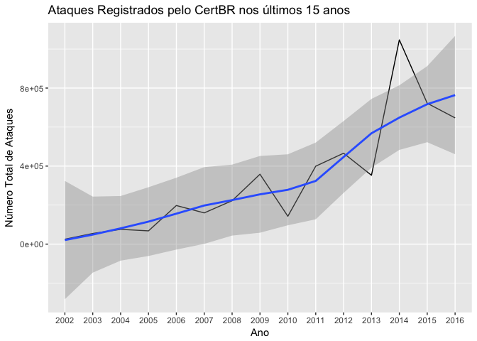
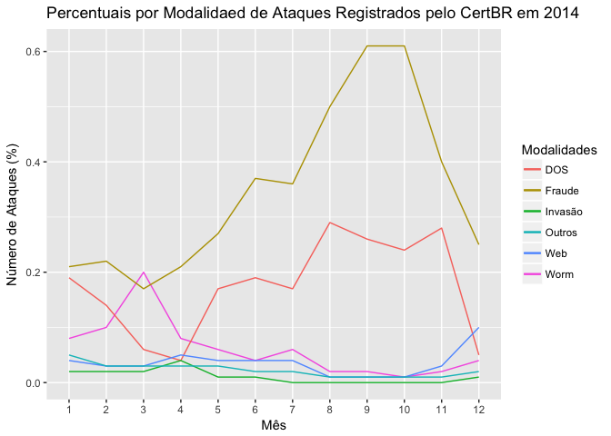

Notebook do Projeto de Data Science
================

``` r
knitr::opts_chunk$set(echo = TRUE)


### Avaliação dos Dados Fornecidos pelo CertBR


### Bibliotecas
library(readr)
library(dplyr)
```

    ## 
    ## Attaching package: 'dplyr'

    ## The following objects are masked from 'package:stats':
    ## 
    ##     filter, lag

    ## The following objects are masked from 'package:base':
    ## 
    ##     intersect, setdiff, setequal, union

``` r
library(stringr)
library(tidyr)
library(ggplot2)


### Suprimindo mensagens de warning 
searchpaths()
```

    ##  [1] ".GlobalEnv"                                                              
    ##  [2] "/Library/Frameworks/R.framework/Versions/3.3/Resources/library/ggplot2"  
    ##  [3] "/Library/Frameworks/R.framework/Versions/3.3/Resources/library/tidyr"    
    ##  [4] "/Library/Frameworks/R.framework/Versions/3.3/Resources/library/stringr"  
    ##  [5] "/Library/Frameworks/R.framework/Versions/3.3/Resources/library/dplyr"    
    ##  [6] "/Library/Frameworks/R.framework/Versions/3.3/Resources/library/readr"    
    ##  [7] "/Library/Frameworks/R.framework/Versions/3.3/Resources/library/stats"    
    ##  [8] "/Library/Frameworks/R.framework/Versions/3.3/Resources/library/graphics" 
    ##  [9] "/Library/Frameworks/R.framework/Versions/3.3/Resources/library/grDevices"
    ## [10] "/Library/Frameworks/R.framework/Versions/3.3/Resources/library/utils"    
    ## [11] "/Library/Frameworks/R.framework/Versions/3.3/Resources/library/datasets" 
    ## [12] "/Library/Frameworks/R.framework/Versions/3.3/Resources/library/methods"  
    ## [13] "Autoloads"                                                               
    ## [14] "/Library/Frameworks/R.framework/Resources/library/base"

``` r
suppressMessages(library(dplyr))


### Consciência situacional
orig <- getwd()
orig
```

    ## [1] "/Users/sidneibarbieri/Documents/CAP386_Sidnei/Projeto"

``` r
setwd(orig)

file.exists("./CertBR.csv")
```

    ## [1] TRUE

``` r
file <- "./CertBR.csv"

tamanho <- file.info(file)$size
tamanho
```

    ## [1] 13717

``` r
### Importando o arquivo (https://www.cert.br/stats/incidentes/)
df <- read.csv2(file, header = TRUE, sep =";", dec=",", stringsAsFactors = FALSE, encoding = "UTF-8")
df <- as.data.frame(df)


### Entendendo o dataframe
head(df)
```

    ##   Ord Mes  Ano Total Worm Worm_P   DOS DOS_P Invasao Invasao_P  Web Web_P
    ## 1   1 jan 2016 54781 4994   9.12   942  1,72     272      0.50 2266  4.14
    ## 2   2 fev 2016 57041 4176   7.32   137  0,24      95      0.17 1422  2.49
    ## 3   3 mar 2016 92852 3886   4.19 12851 13,84     106      0.11 4526  4.87
    ## 4   4 abr 2016 44352 1170   2.64  6147 13,86     126      0.28 1637  3.69
    ## 5   5 mai 2016 49228 3186   6.47   338  0,69     125      0.25 2361  4.80
    ## 6   6 jun 2016 59266 2041   3.44   823  1,39     126      0.21 1554  2.62
    ##    Scan Scan_P Fraude Fraude_P
    ## 1 32959  60.17  11846    21.62
    ## 2 40911  71.72   8783    15.40
    ## 3 58962  63.50  10573    11.39
    ## 4 22531  50.80  11681    26.34
    ## 5 27496  55.85  14456    29.37
    ## 6 41210  69.53  12646    21.34

``` r
class(df)
```

    ## [1] "data.frame"

``` r
str(df)
```

    ## 'data.frame':    180 obs. of  16 variables:
    ##  $ Ord      : int  1 2 3 4 5 6 7 8 9 10 ...
    ##  $ Mes      : chr  "jan" "fev" "mar" "abr" ...
    ##  $ Ano      : int  2016 2016 2016 2016 2016 2016 2016 2016 2016 2016 ...
    ##  $ Total    : int  54781 57041 92852 44352 49228 59266 38402 49596 45472 35372 ...
    ##  $ Worm     : int  4994 4176 3886 1170 3186 2041 1766 1927 1583 1293 ...
    ##  $ Worm_P   : num  9.12 7.32 4.19 2.64 6.47 3.44 4.6 3.89 3.48 3.66 ...
    ##  $ DOS      : chr  "942" "137" "12851" "6147" ...
    ##  $ DOS_P    : chr  "1,72" "0,24" "13,84" "13,86" ...
    ##  $ Invasao  : int  272 95 106 126 125 126 116 137 145 86 ...
    ##  $ Invasao_P: num  0.5 0.17 0.11 0.28 0.25 0.21 0.3 0.28 0.32 0.24 ...
    ##  $ Web      : int  2266 1422 4526 1637 2361 1554 1804 10802 6027 5050 ...
    ##  $ Web_P    : num  4.14 2.49 4.87 3.69 4.8 ...
    ##  $ Scan     : int  32959 40911 58962 22531 27496 41210 25763 27970 21596 23257 ...
    ##  $ Scan_P   : num  60.2 71.7 63.5 50.8 55.9 ...
    ##  $ Fraude   : int  11846 8783 10573 11681 14456 12646 6252 7402 6082 4182 ...
    ##  $ Fraude_P : num  21.6 15.4 11.4 26.3 29.4 ...

``` r
summary(df)
```

    ##       Ord             Mes                 Ano           Total       
    ##  Min.   :  1.00   Length:180         Min.   :2002   Min.   :  1181  
    ##  1st Qu.: 45.75   Class :character   1st Qu.:2005   1st Qu.:  7471  
    ##  Median : 90.50   Mode  :character   Median :2009   Median : 15522  
    ##  Mean   : 90.50                      Mean   :2009   Mean   : 27444  
    ##  3rd Qu.:135.25                      3rd Qu.:2013   3rd Qu.: 40804  
    ##  Max.   :180.00                      Max.   :2016   Max.   :214954  
    ##       Worm           Worm_P           DOS               DOS_P          
    ##  Min.   :  164   Min.   : 1.240   Length:180         Length:180        
    ##  1st Qu.: 1493   1st Qu.: 6.832   Class :character   Class :character  
    ##  Median : 2372   Median :15.940   Mode  :character   Mode  :character  
    ##  Mean   : 3332   Mean   :23.966                                        
    ##  3rd Qu.: 3557   3rd Qu.:39.502                                        
    ##  Max.   :26748   Max.   :78.700                                        
    ##     Invasao         Invasao_P           Web               Web_P       
    ##  Min.   :   1.0   Min.   :0.0100   Min.   :    8.00   Min.   : 0.090  
    ##  1st Qu.:   9.0   1st Qu.:0.0800   1st Qu.:   49.75   1st Qu.: 0.870  
    ##  Median :  24.0   Median :0.2500   Median :  467.00   Median : 2.545  
    ##  Mean   : 178.1   Mean   :0.6223   Mean   : 1289.77   Mean   : 3.603  
    ##  3rd Qu.: 145.0   3rd Qu.:0.7675   3rd Qu.: 1558.75   3rd Qu.: 5.343  
    ##  Max.   :2149.0   Max.   :6.0000   Max.   :10802.00   Max.   :21.780  
    ##       Scan           Scan_P          Fraude          Fraude_P    
    ##  Min.   :  758   Min.   : 3.64   Min.   :     1   Min.   : 0.08  
    ##  1st Qu.: 2320   1st Qu.:26.35   1st Qu.:  2320   1st Qu.:10.63  
    ##  Median : 4578   Median :39.67   Median :  3534   Median :18.73  
    ##  Mean   :10517   Mean   :39.81   Mean   :  8196   Mean   :23.30  
    ##  3rd Qu.:15067   3rd Qu.:52.40   3rd Qu.:  7151   3rd Qu.:31.32  
    ##  Max.   :58962   Max.   :76.56   Max.   :130108   Max.   :89.62

``` r
sample_n(df, size = 5)
```

    ##     Ord Mes  Ano Total Worm Worm_P DOS DOS_P Invasao Invasao_P Web Web_P
    ## 151 151 jul 2004  6773 4636  68.45   2  0,03       7      0.10  49  0.72
    ## 99   99 mar 2008 11586 2579  22.26   4  0,03      25      0.22 420  3.63
    ## 147 147 mar 2004  6002 2653  44.20  19  0,32      56      0.93  32  0.53
    ## 136 136 abr 2005  5253 1432  27.26   -     -      20      0.38  25  0.48
    ## 163 163 jul 2003  3622 1386  38.27   1  0,03      11      0.30  52  1.44
    ##     Scan Scan_P Fraude Fraude_P
    ## 151 1791  26.44    270     3.99
    ## 99  3661  31.60   4881    42.13
    ## 147 2862  47.68    343     5.71
    ## 136 1437  27.36   2322    44.20
    ## 163 2052  56.65     39     1.08

``` r
### Conversões das colunas
df$Total <- as.integer(df$Total)
df$Worm <- as.integer(df$Worm)
df$Worm_P <- as.double(df$Worm_P)
df$DOS <- as.integer(df$DOS)
```

    ## Warning: NAs introduzidos por coerção

``` r
df$DOS_P <- as.double(df$DOS_P)
```

    ## Warning: NAs introduzidos por coerção

``` r
df$Invasao <- as.integer(df$Invasao)
df$Invasao_P <- as.double(df$Invasao_P)
df$Web <- as.integer(df$Web)
df$Web_P <- as.double(df$Web_P)
df$Scan <- as.integer(df$Scan)
df$Scan_P <- as.double(df$Scan_P)
df$Fraude <- as.integer(df$Fraude)
df$Fraude_P <- as.double(df$Fraude_P)


### Remover NAs (Subsituir por zero)
df[is.na(df)] <- 0 
sample_n(df, size = 10)
```

    ##     Ord Mes  Ano Total Worm Worm_P DOS DOS_P Invasao Invasao_P  Web Web_P
    ## 101 101 mai 2008 14567 2760  18.95   7     0     133      0.91  624  4.28
    ## 75   75 mar 2010 11836 2236  18.89   0     0       1      0.01  780  6.59
    ## 173 173 mai 2002  1267  408  32.20   1     0       6      0.47   15  1.18
    ## 72   72 dez 2011 25581 6214  24.29   9     0       6      0.02 1532  5.99
    ## 61   61 jan 2011 16840 1041   6.18   9     0       6      0.04  996  5.91
    ## 149 149 mai 2004  5471 2260  41.31   2     0      19      0.35   58  1.06
    ## 169 169 jan 2002  1453  268  18.44   4     0      10      0.69   33  2.27
    ## 163 163 jul 2003  3622 1386  38.27   1     0      11      0.30   52  1.44
    ## 78   78 jun 2010 11680 1324  11.34   2     0       2      0.02  706  6.04
    ## 58   58 out 2012 39326 3380   8.59   9     0     754      1.92 1186  3.02
    ##      Scan Scan_P Fraude Fraude_P
    ## 101  3716  25.51   7274    49.93
    ## 75   4573  38.64   3529    29.82
    ## 173   758  59.83     13     1.03
    ## 72  10104  39.50   3155    12.33
    ## 61   8343  49.54   3098    18.40
    ## 149  2913  53.24    181     3.31
    ## 169  1072  73.78      3     0.21
    ## 163  2052  56.65     39     1.08
    ## 78   6533  55.93   2872    24.59
    ## 58  23229  59.07   6442    16.38

``` r
### Verificar se o Total corresponde à soma das demais colunas
df$Total -  (df$Worm + df$DOS + df$Invasao + df$Web + df$Scan + df$Fraude)
```

    ##   [1]  1502  1517  1948  1060  1266   866  1025  1098   868  1094  1379
    ##  [12]  1052  1599  1791  2022  1678  2118  1509  2133  1751  2043  1125
    ##  [23]  1630  1622  1546  1198  1457  1174  1317  1029  1158  1012  1215
    ##  [34]  1242   992   968  5180  4135  4342  4775  3728  3624  4301  3452
    ##  [45]  2590  2684  2593  1513  4997  5459 12585 12471 11871  9053  7728
    ##  [56]  7412  6632  4326  3603  5686  3347 12932 32746 31668 30644 26844
    ##  [67] 26477 12395  5406  5093  4500  4561   761   383   717   518   321
    ##  [78]   241   345   239   233   180   240   262    52   282   284   505
    ##  [89]   270   319   472   264   354   447   423   497    51    18    16
    ## [100]    24    53    75   171   192   185    85   101    80     0     0
    ## [111]     0     0     0     0     0     0     0     0     0     0     0
    ## [122]     0     0     0     0     0     0     0     0     0     0     0
    ## [133]    16     5     1    17     4     0     3     7     2     4     4
    ## [144]     2    39    53    37    36    38    24    18    26    56    23
    ## [155]    10    46    72    60    81    66    62   168    81   181    38
    ## [166]    33    60    25    63    86   106    78    66    90   108    92
    ## [177]   104   168    97   101

``` r
### Acrescentar e validar a coluna "Outros"
df$Outros <- df$Total - (df$Worm + df$DOS + df$Invasao + df$Web + df$Scan + df$Fraude)
df$Outros <- as.integer(df$Outros)
df$Total -  (df$Worm + df$DOS + df$Invasao + df$Web + df$Scan + df$Fraude + df$Outros)
```

    ##   [1] 0 0 0 0 0 0 0 0 0 0 0 0 0 0 0 0 0 0 0 0 0 0 0 0 0 0 0 0 0 0 0 0 0 0 0
    ##  [36] 0 0 0 0 0 0 0 0 0 0 0 0 0 0 0 0 0 0 0 0 0 0 0 0 0 0 0 0 0 0 0 0 0 0 0
    ##  [71] 0 0 0 0 0 0 0 0 0 0 0 0 0 0 0 0 0 0 0 0 0 0 0 0 0 0 0 0 0 0 0 0 0 0 0
    ## [106] 0 0 0 0 0 0 0 0 0 0 0 0 0 0 0 0 0 0 0 0 0 0 0 0 0 0 0 0 0 0 0 0 0 0 0
    ## [141] 0 0 0 0 0 0 0 0 0 0 0 0 0 0 0 0 0 0 0 0 0 0 0 0 0 0 0 0 0 0 0 0 0 0 0
    ## [176] 0 0 0 0 0

``` r
### Acresdentar coluna com valores percentuais para "Outros"
df$Outros_P <- as.double(df$Outros / df$Total)


### Overview: identificar se há problemas no arredondamento dos valores (se a soma de percentuais é 100)
glimpse(df)
```

    ## Observations: 180
    ## Variables: 18
    ## $ Ord       <int> 1, 2, 3, 4, 5, 6, 7, 8, 9, 10, 11, 12, 13, 14, 15, 1...
    ## $ Mes       <chr> "jan", "fev", "mar", "abr", "mai", "jun", "jul", "ag...
    ## $ Ano       <int> 2016, 2016, 2016, 2016, 2016, 2016, 2016, 2016, 2016...
    ## $ Total     <int> 54781, 57041, 92852, 44352, 49228, 59266, 38402, 495...
    ## $ Worm      <int> 4994, 4176, 3886, 1170, 3186, 2041, 1766, 1927, 1583...
    ## $ Worm_P    <dbl> 9.12, 7.32, 4.19, 2.64, 6.47, 3.44, 4.60, 3.89, 3.48...
    ## $ DOS       <dbl> 942, 137, 12851, 6147, 338, 823, 1676, 260, 9171, 41...
    ## $ DOS_P     <dbl> 0, 0, 0, 0, 0, 0, 0, 0, 0, 0, 0, 0, 0, 0, 0, 0, 0, 0...
    ## $ Invasao   <int> 272, 95, 106, 126, 125, 126, 116, 137, 145, 86, 320,...
    ## $ Invasao_P <dbl> 0.50, 0.17, 0.11, 0.28, 0.25, 0.21, 0.30, 0.28, 0.32...
    ## $ Web       <int> 2266, 1422, 4526, 1637, 2361, 1554, 1804, 10802, 602...
    ## $ Web_P     <dbl> 4.14, 2.49, 4.87, 3.69, 4.80, 2.62, 4.70, 21.78, 13....
    ## $ Scan      <int> 32959, 40911, 58962, 22531, 27496, 41210, 25763, 279...
    ## $ Scan_P    <dbl> 60.17, 71.72, 63.50, 50.80, 55.85, 69.53, 67.09, 56....
    ## $ Fraude    <int> 11846, 8783, 10573, 11681, 14456, 12646, 6252, 7402,...
    ## $ Fraude_P  <dbl> 21.62, 15.40, 11.39, 26.34, 29.37, 21.34, 16.28, 14....
    ## $ Outros    <int> 1502, 1517, 1948, 1060, 1266, 866, 1025, 1098, 868, ...
    ## $ Outros_P  <dbl> 0.02741827, 0.02659491, 0.02097962, 0.02389971, 0.02...

``` r
glimpse(mutate(df, Soma100 = Worm_P + DOS_P + Invasao_P + Web_P + Scan_P + Fraude_P + Outros_P))
```

    ## Observations: 180
    ## Variables: 19
    ## $ Ord       <int> 1, 2, 3, 4, 5, 6, 7, 8, 9, 10, 11, 12, 13, 14, 15, 1...
    ## $ Mes       <chr> "jan", "fev", "mar", "abr", "mai", "jun", "jul", "ag...
    ## $ Ano       <int> 2016, 2016, 2016, 2016, 2016, 2016, 2016, 2016, 2016...
    ## $ Total     <int> 54781, 57041, 92852, 44352, 49228, 59266, 38402, 495...
    ## $ Worm      <int> 4994, 4176, 3886, 1170, 3186, 2041, 1766, 1927, 1583...
    ## $ Worm_P    <dbl> 9.12, 7.32, 4.19, 2.64, 6.47, 3.44, 4.60, 3.89, 3.48...
    ## $ DOS       <dbl> 942, 137, 12851, 6147, 338, 823, 1676, 260, 9171, 41...
    ## $ DOS_P     <dbl> 0, 0, 0, 0, 0, 0, 0, 0, 0, 0, 0, 0, 0, 0, 0, 0, 0, 0...
    ## $ Invasao   <int> 272, 95, 106, 126, 125, 126, 116, 137, 145, 86, 320,...
    ## $ Invasao_P <dbl> 0.50, 0.17, 0.11, 0.28, 0.25, 0.21, 0.30, 0.28, 0.32...
    ## $ Web       <int> 2266, 1422, 4526, 1637, 2361, 1554, 1804, 10802, 602...
    ## $ Web_P     <dbl> 4.14, 2.49, 4.87, 3.69, 4.80, 2.62, 4.70, 21.78, 13....
    ## $ Scan      <int> 32959, 40911, 58962, 22531, 27496, 41210, 25763, 279...
    ## $ Scan_P    <dbl> 60.17, 71.72, 63.50, 50.80, 55.85, 69.53, 67.09, 56....
    ## $ Fraude    <int> 11846, 8783, 10573, 11681, 14456, 12646, 6252, 7402,...
    ## $ Fraude_P  <dbl> 21.62, 15.40, 11.39, 26.34, 29.37, 21.34, 16.28, 14....
    ## $ Outros    <int> 1502, 1517, 1948, 1060, 1266, 866, 1025, 1098, 868, ...
    ## $ Outros_P  <dbl> 0.02741827, 0.02659491, 0.02097962, 0.02389971, 0.02...
    ## $ Soma100   <dbl> 95.57742, 97.12659, 84.08098, 83.77390, 96.76572, 97...

``` r
glimpse(mutate(df, Soma = Worm + DOS + Invasao + Web + Scan + Fraude + Outros))
```

    ## Observations: 180
    ## Variables: 19
    ## $ Ord       <int> 1, 2, 3, 4, 5, 6, 7, 8, 9, 10, 11, 12, 13, 14, 15, 1...
    ## $ Mes       <chr> "jan", "fev", "mar", "abr", "mai", "jun", "jul", "ag...
    ## $ Ano       <int> 2016, 2016, 2016, 2016, 2016, 2016, 2016, 2016, 2016...
    ## $ Total     <int> 54781, 57041, 92852, 44352, 49228, 59266, 38402, 495...
    ## $ Worm      <int> 4994, 4176, 3886, 1170, 3186, 2041, 1766, 1927, 1583...
    ## $ Worm_P    <dbl> 9.12, 7.32, 4.19, 2.64, 6.47, 3.44, 4.60, 3.89, 3.48...
    ## $ DOS       <dbl> 942, 137, 12851, 6147, 338, 823, 1676, 260, 9171, 41...
    ## $ DOS_P     <dbl> 0, 0, 0, 0, 0, 0, 0, 0, 0, 0, 0, 0, 0, 0, 0, 0, 0, 0...
    ## $ Invasao   <int> 272, 95, 106, 126, 125, 126, 116, 137, 145, 86, 320,...
    ## $ Invasao_P <dbl> 0.50, 0.17, 0.11, 0.28, 0.25, 0.21, 0.30, 0.28, 0.32...
    ## $ Web       <int> 2266, 1422, 4526, 1637, 2361, 1554, 1804, 10802, 602...
    ## $ Web_P     <dbl> 4.14, 2.49, 4.87, 3.69, 4.80, 2.62, 4.70, 21.78, 13....
    ## $ Scan      <int> 32959, 40911, 58962, 22531, 27496, 41210, 25763, 279...
    ## $ Scan_P    <dbl> 60.17, 71.72, 63.50, 50.80, 55.85, 69.53, 67.09, 56....
    ## $ Fraude    <int> 11846, 8783, 10573, 11681, 14456, 12646, 6252, 7402,...
    ## $ Fraude_P  <dbl> 21.62, 15.40, 11.39, 26.34, 29.37, 21.34, 16.28, 14....
    ## $ Outros    <int> 1502, 1517, 1948, 1060, 1266, 866, 1025, 1098, 868, ...
    ## $ Outros_P  <dbl> 0.02741827, 0.02659491, 0.02097962, 0.02389971, 0.02...
    ## $ Soma      <dbl> 54781, 57041, 92852, 44352, 49228, 59266, 38402, 495...

``` r
### Corrigindo os arredondamentos e a representação (duas casas decimais):
df$Worm_P <- as.double(df$Worm / df$Total)
df$DOS_P <- as.double(df$DOS / df$Total)
df$Invasao_P <- as.double(df$Invasao / df$Total)
df$Web_P <- as.double(df$Web / df$Total)
df$Scan_P <- as.double(df$Scan / df$Total)
df$Fraude_P <- as.double(df$Fraude / df$Total)
df$Outros_P <- as.double(df$Outros / df$Total)


### Validar a soma de valores percentuais
glimpse(mutate(df, Soma100 = Worm_P + DOS_P + Invasao_P + Web_P + Scan_P + Fraude_P + Outros_P))
```

    ## Observations: 180
    ## Variables: 19
    ## $ Ord       <int> 1, 2, 3, 4, 5, 6, 7, 8, 9, 10, 11, 12, 13, 14, 15, 1...
    ## $ Mes       <chr> "jan", "fev", "mar", "abr", "mai", "jun", "jul", "ag...
    ## $ Ano       <int> 2016, 2016, 2016, 2016, 2016, 2016, 2016, 2016, 2016...
    ## $ Total     <int> 54781, 57041, 92852, 44352, 49228, 59266, 38402, 495...
    ## $ Worm      <int> 4994, 4176, 3886, 1170, 3186, 2041, 1766, 1927, 1583...
    ## $ Worm_P    <dbl> 0.09116299, 0.07321050, 0.04185155, 0.02637987, 0.06...
    ## $ DOS       <dbl> 942, 137, 12851, 6147, 338, 823, 1676, 260, 9171, 41...
    ## $ DOS_P     <dbl> 0.0171957430, 0.0024017812, 0.1384030500, 0.13859577...
    ## $ Invasao   <int> 272, 95, 106, 126, 125, 126, 116, 137, 145, 86, 320,...
    ## $ Invasao_P <dbl> 0.0049652252, 0.0016654687, 0.0011416017, 0.00284090...
    ## $ Web       <int> 2266, 1422, 4526, 1637, 2361, 1554, 1804, 10802, 602...
    ## $ Web_P     <dbl> 0.04136471, 0.02492944, 0.04874424, 0.03690927, 0.04...
    ## $ Scan      <int> 32959, 40911, 58962, 22531, 27496, 41210, 25763, 279...
    ## $ Scan_P    <dbl> 0.6016502, 0.7172209, 0.6350106, 0.5080041, 0.558543...
    ## $ Fraude    <int> 11846, 8783, 10573, 11681, 14456, 12646, 6252, 7402,...
    ## $ Fraude_P  <dbl> 0.21624286, 0.15397696, 0.11386938, 0.26337031, 0.29...
    ## $ Outros    <int> 1502, 1517, 1948, 1060, 1266, 866, 1025, 1098, 868, ...
    ## $ Outros_P  <dbl> 0.02741827, 0.02659491, 0.02097962, 0.02389971, 0.02...
    ## $ Soma100   <dbl> 1, 1, 1, 1, 1, 1, 1, 1, 1, 1, 1, 1, 1, 1, 1, 1, 1, 1...

``` r
### Corrigindo os arredondamentos e a representação (duas casas decimais):
df$Worm_P <- as.double(sprintf("%0.2f", (df$Worm / df$Total)))
df$DOS_P <- as.double(sprintf("%0.2f", (df$DOS / df$Total)))
df$Invasao_P <- as.double(sprintf("%0.2f", (df$Invasao / df$Total)))
df$Web_P <- as.double(sprintf("%0.2f", (df$Web / df$Total)))
df$Scan_P <- as.double(sprintf("%0.2f", (df$Scan / df$Total)))
df$Fraude_P <- as.double(sprintf("%0.2f", (df$Fraude / df$Total)))
df$Outros_P <- as.double(sprintf("%0.2f", (df$Outros / df$Total)))


### Após o arredondamento há uma instabilidade leve
glimpse(mutate(df, Soma100 = Worm_P + DOS_P + Invasao_P + Web_P + Scan_P + Fraude_P + Outros_P))
```

    ## Observations: 180
    ## Variables: 19
    ## $ Ord       <int> 1, 2, 3, 4, 5, 6, 7, 8, 9, 10, 11, 12, 13, 14, 15, 1...
    ## $ Mes       <chr> "jan", "fev", "mar", "abr", "mai", "jun", "jul", "ag...
    ## $ Ano       <int> 2016, 2016, 2016, 2016, 2016, 2016, 2016, 2016, 2016...
    ## $ Total     <int> 54781, 57041, 92852, 44352, 49228, 59266, 38402, 495...
    ## $ Worm      <int> 4994, 4176, 3886, 1170, 3186, 2041, 1766, 1927, 1583...
    ## $ Worm_P    <dbl> 0.09, 0.07, 0.04, 0.03, 0.06, 0.03, 0.05, 0.04, 0.03...
    ## $ DOS       <dbl> 942, 137, 12851, 6147, 338, 823, 1676, 260, 9171, 41...
    ## $ DOS_P     <dbl> 0.02, 0.00, 0.14, 0.14, 0.01, 0.01, 0.04, 0.01, 0.20...
    ## $ Invasao   <int> 272, 95, 106, 126, 125, 126, 116, 137, 145, 86, 320,...
    ## $ Invasao_P <dbl> 0.00, 0.00, 0.00, 0.00, 0.00, 0.00, 0.00, 0.00, 0.00...
    ## $ Web       <int> 2266, 1422, 4526, 1637, 2361, 1554, 1804, 10802, 602...
    ## $ Web_P     <dbl> 0.04, 0.02, 0.05, 0.04, 0.05, 0.03, 0.05, 0.22, 0.13...
    ## $ Scan      <int> 32959, 40911, 58962, 22531, 27496, 41210, 25763, 279...
    ## $ Scan_P    <dbl> 0.60, 0.72, 0.64, 0.51, 0.56, 0.70, 0.67, 0.56, 0.47...
    ## $ Fraude    <int> 11846, 8783, 10573, 11681, 14456, 12646, 6252, 7402,...
    ## $ Fraude_P  <dbl> 0.22, 0.15, 0.11, 0.26, 0.29, 0.21, 0.16, 0.15, 0.13...
    ## $ Outros    <int> 1502, 1517, 1948, 1060, 1266, 866, 1025, 1098, 868, ...
    ## $ Outros_P  <dbl> 0.03, 0.03, 0.02, 0.02, 0.03, 0.01, 0.03, 0.02, 0.02...
    ## $ Soma100   <dbl> 1.00, 0.99, 1.00, 1.00, 1.00, 0.99, 1.00, 1.00, 0.98...

``` r
### Overview
sample_n(df, size = 5)
```

    ##     Ord Mes  Ano Total Worm Worm_P DOS DOS_P Invasao Invasao_P   Web Web_P
    ## 179 179 nov 2002  4436 3491   0.79   5  0.00       8      0.00    18  0.00
    ## 8     8 ago 2016 49596 1927   0.04 260  0.01     137      0.00 10802  0.22
    ## 170 170 fev 2002  1186  170   0.14   2  0.00      14      0.01    15  0.01
    ## 16   16 abr 2015 52991 3046   0.06  34  0.00     150      0.00  6297  0.12
    ## 175 175 jul 2002  1900  808   0.43  14  0.01      25      0.01    20  0.01
    ##      Scan Scan_P Fraude Fraude_P Outros Outros_P
    ## 179   806   0.18     11     0.00     97     0.02
    ## 8   27970   0.56   7402     0.15   1098     0.02
    ## 170   898   0.76      1     0.00     86     0.07
    ## 16  31215   0.59  10571     0.20   1678     0.03
    ## 175   920   0.48      5     0.00    108     0.06

``` r
### Seleção de partes
dfData <- select(df, Ano, Mes, Total)
head(dfData)
```

    ##    Ano Mes Total
    ## 1 2016 jan 54781
    ## 2 2016 fev 57041
    ## 3 2016 mar 92852
    ## 4 2016 abr 44352
    ## 5 2016 mai 49228
    ## 6 2016 jun 59266

``` r
class(dfData)
```

    ## [1] "data.frame"

``` r
dfSelect <- select(df, Ano:Total)
sample_n(dfSelect, size = 5)
```

    ##      Ano  Total
    ## 17  2015  58322
    ## 35  2014 107219
    ## 126 2006  17470
    ## 156 2004   4736
    ## 89  2009  43819

``` r
### Verificar se constam as informações de todos os 12 meses
count(df, Ano)
```

    ## # A tibble: 15 x 2
    ##      Ano     n
    ##    <int> <int>
    ##  1  2002    12
    ##  2  2003    12
    ##  3  2004    12
    ##  4  2005    12
    ##  5  2006    12
    ##  6  2007    12
    ##  7  2008    12
    ##  8  2009    12
    ##  9  2010    12
    ## 10  2011    12
    ## 11  2012    12
    ## 12  2013    12
    ## 13  2014    12
    ## 14  2015    12
    ## 15  2016    12

``` r
### Filtrar valores significativos
filter(df, Total > 100000)
```

    ##   Ord Mes  Ano  Total  Worm Worm_P   DOS DOS_P Invasao Invasao_P  Web
    ## 1  32 ago 2014 134156  3327   0.02 38822  0.29     187         0 1828
    ## 2  33 set 2014 214954  3312   0.02 56184  0.26     290         0 2347
    ## 3  34 out 2014 206148  2563   0.01 50195  0.24     296         0 3029
    ## 4  35 nov 2014 107219  2571   0.02 29566  0.28     201         0 3416
    ## 5  85 jan 2009 105945 26748   0.25     0  0.00      13         0  364
    ##   Web_P  Scan Scan_P Fraude Fraude_P Outros Outros_P
    ## 1  0.01 21500   0.16  67480     0.50   1012     0.01
    ## 2  0.01 21498   0.10 130108     0.61   1215     0.01
    ## 3  0.01 23763   0.12 125060     0.61   1242     0.01
    ## 4  0.03 28053   0.26  42420     0.40    992     0.01
    ## 5  0.00  3859   0.04  74909     0.71     52     0.00

``` r
filter(df, Total > 50000, Fraude > 100000)
```

    ##   Ord Mes  Ano  Total Worm Worm_P   DOS DOS_P Invasao Invasao_P  Web Web_P
    ## 1  33 set 2014 214954 3312   0.02 56184  0.26     290         0 2347  0.01
    ## 2  34 out 2014 206148 2563   0.01 50195  0.24     296         0 3029  0.01
    ##    Scan Scan_P Fraude Fraude_P Outros Outros_P
    ## 1 21498   0.10 130108     0.61   1215     0.01
    ## 2 23763   0.12 125060     0.61   1242     0.01

``` r
filter(df, Total > 50000, Fraude > 100000, Mes %in% c("ago", "set"), Ano %in% c("2014"))
```

    ##   Ord Mes  Ano  Total Worm Worm_P   DOS DOS_P Invasao Invasao_P  Web Web_P
    ## 1  33 set 2014 214954 3312   0.02 56184  0.26     290         0 2347  0.01
    ##    Scan Scan_P Fraude Fraude_P Outros Outros_P
    ## 1 21498    0.1 130108     0.61   1215     0.01

``` r
### Identificando padrões com arrange () 
tbl_df(df) %>% arrange(Ano) %>% head
```

    ## # A tibble: 6 x 18
    ##     Ord   Mes   Ano Total  Worm Worm_P   DOS DOS_P Invasao Invasao_P
    ##   <int> <chr> <int> <int> <int>  <dbl> <dbl> <dbl>   <int>     <dbl>
    ## 1   169   jan  2002  1453   268   0.18     4     0      10      0.01
    ## 2   170   fev  2002  1186   170   0.14     2     0      14      0.01
    ## 3   171   mar  2002  1254   164   0.13     0     0      10      0.01
    ## 4   172   abr  2002  1181   204   0.17     1     0      10      0.01
    ## 5   173   mai  2002  1267   408   0.32     1     0       6      0.00
    ## 6   174   jun  2002  1407   374   0.27     3     0      12      0.01
    ## # ... with 8 more variables: Web <int>, Web_P <dbl>, Scan <int>,
    ## #   Scan_P <dbl>, Fraude <int>, Fraude_P <dbl>, Outros <int>,
    ## #   Outros_P <dbl>

``` r
tbl_df(df)  %>% arrange(Mes)
```

    ## # A tibble: 180 x 18
    ##      Ord   Mes   Ano Total  Worm Worm_P   DOS DOS_P Invasao Invasao_P
    ##    <int> <chr> <int> <int> <int>  <dbl> <dbl> <dbl>   <int>     <dbl>
    ##  1     4   abr  2016 44352  1170   0.03  6147  0.14     126      0.00
    ##  2    16   abr  2015 52991  3046   0.06    34  0.00     150      0.00
    ##  3    28   abr  2014 41533  3513   0.08  1505  0.04    1559      0.04
    ##  4    40   abr  2013 29943  2084   0.07    14  0.00    1511      0.05
    ##  5    52   abr  2012 35342  3171   0.09     9  0.00     100      0.00
    ##  6    64   abr  2011 44908  1157   0.03    10  0.00      12      0.00
    ##  7    76   abr  2010 11462  2127   0.19     0  0.00       3      0.00
    ##  8    88   abr  2009 25496   468   0.02   682  0.03      20      0.00
    ##  9   100   abr  2008 14333  1883   0.13     3  0.00       5      0.00
    ## 10   112   abr  2007 14152  6416   0.45    11  0.00       6      0.00
    ## # ... with 170 more rows, and 8 more variables: Web <int>, Web_P <dbl>,
    ## #   Scan <int>, Scan_P <dbl>, Fraude <int>, Fraude_P <dbl>, Outros <int>,
    ## #   Outros_P <dbl>

``` r
tbl_df(df)  %>% select(Mes, Ano, Total)  %>% arrange(Mes)
```

    ## # A tibble: 180 x 3
    ##      Mes   Ano Total
    ##    <chr> <int> <int>
    ##  1   abr  2016 44352
    ##  2   abr  2015 52991
    ##  3   abr  2014 41533
    ##  4   abr  2013 29943
    ##  5   abr  2012 35342
    ##  6   abr  2011 44908
    ##  7   abr  2010 11462
    ##  8   abr  2009 25496
    ##  9   abr  2008 14333
    ## 10   abr  2007 14152
    ## # ... with 170 more rows

``` r
tbl_df(df)  %>% select(Mes, Ano, Total)  %>% arrange(Mes) %>% filter(Total > median(Total, na.rm = TRUE))
```

    ## # A tibble: 90 x 3
    ##      Mes   Ano  Total
    ##    <chr> <int>  <int>
    ##  1   abr  2016  44352
    ##  2   abr  2015  52991
    ##  3   abr  2014  41533
    ##  4   abr  2013  29943
    ##  5   abr  2012  35342
    ##  6   abr  2011  44908
    ##  7   abr  2009  25496
    ##  8   ago  2016  49596
    ##  9   ago  2015  65486
    ## 10   ago  2014 134156
    ## # ... with 80 more rows

``` r
tbl_df(df)  %>% select(Mes, Ano, Total)  %>% arrange(Mes) %>% filter(Ano >= 2011)
```

    ## # A tibble: 72 x 3
    ##      Mes   Ano  Total
    ##    <chr> <int>  <int>
    ##  1   abr  2016  44352
    ##  2   abr  2015  52991
    ##  3   abr  2014  41533
    ##  4   abr  2013  29943
    ##  5   abr  2012  35342
    ##  6   abr  2011  44908
    ##  7   ago  2016  49596
    ##  8   ago  2015  65486
    ##  9   ago  2014 134156
    ## 10   ago  2013  28531
    ## # ... with 62 more rows

``` r
tbl_df(df)  %>% select(Mes, Ano, Total)  %>% arrange(Mes, desc(Mes)) %>% filter(Ano >= 2011)
```

    ## # A tibble: 72 x 3
    ##      Mes   Ano  Total
    ##    <chr> <int>  <int>
    ##  1   abr  2016  44352
    ##  2   abr  2015  52991
    ##  3   abr  2014  41533
    ##  4   abr  2013  29943
    ##  5   abr  2012  35342
    ##  6   abr  2011  44908
    ##  7   ago  2016  49596
    ##  8   ago  2015  65486
    ##  9   ago  2014 134156
    ## 10   ago  2013  28531
    ## # ... with 62 more rows

``` r
head(df)
```

    ##   Ord Mes  Ano Total Worm Worm_P   DOS DOS_P Invasao Invasao_P  Web Web_P
    ## 1   1 jan 2016 54781 4994   0.09   942  0.02     272         0 2266  0.04
    ## 2   2 fev 2016 57041 4176   0.07   137  0.00      95         0 1422  0.02
    ## 3   3 mar 2016 92852 3886   0.04 12851  0.14     106         0 4526  0.05
    ## 4   4 abr 2016 44352 1170   0.03  6147  0.14     126         0 1637  0.04
    ## 5   5 mai 2016 49228 3186   0.06   338  0.01     125         0 2361  0.05
    ## 6   6 jun 2016 59266 2041   0.03   823  0.01     126         0 1554  0.03
    ##    Scan Scan_P Fraude Fraude_P Outros Outros_P
    ## 1 32959   0.60  11846     0.22   1502     0.03
    ## 2 40911   0.72   8783     0.15   1517     0.03
    ## 3 58962   0.64  10573     0.11   1948     0.02
    ## 4 22531   0.51  11681     0.26   1060     0.02
    ## 5 27496   0.56  14456     0.29   1266     0.03
    ## 6 41210   0.70  12646     0.21    866     0.01

``` r
### Melhorar a exibição
options(digits = 3)
head(df)
```

    ##   Ord Mes  Ano Total Worm Worm_P   DOS DOS_P Invasao Invasao_P  Web Web_P
    ## 1   1 jan 2016 54781 4994   0.09   942  0.02     272         0 2266  0.04
    ## 2   2 fev 2016 57041 4176   0.07   137  0.00      95         0 1422  0.02
    ## 3   3 mar 2016 92852 3886   0.04 12851  0.14     106         0 4526  0.05
    ## 4   4 abr 2016 44352 1170   0.03  6147  0.14     126         0 1637  0.04
    ## 5   5 mai 2016 49228 3186   0.06   338  0.01     125         0 2361  0.05
    ## 6   6 jun 2016 59266 2041   0.03   823  0.01     126         0 1554  0.03
    ##    Scan Scan_P Fraude Fraude_P Outros Outros_P
    ## 1 32959   0.60  11846     0.22   1502     0.03
    ## 2 40911   0.72   8783     0.15   1517     0.03
    ## 3 58962   0.64  10573     0.11   1948     0.02
    ## 4 22531   0.51  11681     0.26   1060     0.02
    ## 5 27496   0.56  14456     0.29   1266     0.03
    ## 6 41210   0.70  12646     0.21    866     0.01

``` r
### Informações sobre os valores da coluna Total
df  %>% summarise(AvgTotal = mean(Total),
                  MinTotal = min(Total),
                  MaxTotal = max(Total),
                  total = n())
```

    ##   AvgTotal MinTotal MaxTotal total
    ## 1    27444     1181   214954   180

``` r
### Análise de Grupos (Ano)
df  %>% 
  group_by(Ano) %>%
  summarise(AvgTotal = mean(Total),
            MinTotal = min(Total),
            MaxTotal = max(Total),
            total = n())
```

    ## # A tibble: 15 x 5
    ##      Ano AvgTotal MinTotal MaxTotal total
    ##    <int>    <dbl>    <dbl>    <dbl> <int>
    ##  1  2002     2091     1181     4436    12
    ##  2  2003     4551     2948     7036    12
    ##  3  2004     6310     4736    11253    12
    ##  4  2005     5667     3142     7901    12
    ##  5  2006    16491     7742    23414    12
    ##  6  2007    13340     8274    24181    12
    ##  7  2008    18544     7996    71984    12
    ##  8  2009    29862     9213   105945    12
    ##  9  2010    11904     8223    14551    12
    ## 10  2011    33293    16840    47630    12
    ## 11  2012    38836    25266    60018    12
    ## 12  2013    29410    23409    36067    12
    ## 13  2014    87253    33959   214954    12
    ## 14  2015    60184    48027    81244    12
    ## 15  2016    53926    35372    92852    12

``` r
### Análise de Grupos (Mês)
df  %>% 
  group_by(Mes) %>%
  summarise(AvgTotal = mean(Total),
            MinTotal = min(Total),
            MaxTotal = max(Total),
            total = n())
```

    ## # A tibble: 12 x 5
    ##      Mes AvgTotal MinTotal MaxTotal total
    ##    <chr>    <dbl>    <dbl>    <dbl> <int>
    ##  1   abr    22902     1181    52991    15
    ##  2   ago    30244     1716   134156    15
    ##  3   dez    26590     3545    71984    15
    ##  4   fev    24783     1186    73883    15
    ##  5   jan    27265     1453   105945    15
    ##  6   jul    23244     1900    58662    15
    ##  7   jun    25629     1407    81244    15
    ##  8   mai    25341     1267    58322    15
    ##  9   mar    27183     1254    92852    15
    ## 10   nov    29300     4436   107219    15
    ## 11   out    32480     3783   206148    15
    ## 12   set    34367     1964   214954    15

``` r
### Linegraph dos Totais de Ataques por Ano
dfA <- df  %>% 
  group_by(Ano) %>%
  summarise(Total = sum(Total),
            Meses = n())

dfA$Ano <- as.factor(dfA$Ano)
ggplot(dfA, aes(x = Ano, y = Total,  group = Ano)) + 
  geom_line(aes(group = 1)) +
  geom_smooth(method = "loess", size = 1, aes(group = 1), se = T) + 
  labs(x = "Ano", y = "Número de Ataques", title = "Ataques Registrados pelo CertBR nos últimos 15 anos")
```


``` r
#Obs.: 2014 foi o pico mas, de maneira geral, o número de ataques é crescente

### Análises Diversas (Ataques de DOS acima da média)
df  %>% 
  select(Mes, Ano, DOS)   %>% 
  filter(DOS > mean(DOS))  %>%
  head
```

    ##   Mes  Ano   DOS
    ## 1 mar 2016 12851
    ## 2 abr 2016  6147
    ## 3 set 2016  9171
    ## 4 nov 2016 15735
    ## 5 dez 2016 11942
    ## 6 fev 2015  2056

``` r
### Remodelagem dos dados com TidyR
df$Mes <- c(01, 02, 03, 04, 05, 06, 07, 08, 09, 10, 11, 12)
df$Mes <- as.factor(df$Mes)
df$Ano <- as.factor(df$Ano)

### Corrigindo sequência cronológica
df <- df  %>% select(Mes, Ano, Worm, Worm_P, DOS, DOS_P, Invasao, Invasao_P, Web, Web_P, Scan, Scan_P, Fraude, Fraude_P, Outros, Outros_P, Total)  %>% arrange(Mes, desc(Mes)) %>% arrange(Ano, desc(Ano))


### Linegraph dos Totais de Ataques por Mês
dfM <- df  %>% 
  group_by(Mes) %>%
  summarise(Total = sum(Total),
            Media = Total/15,
            Meses = n())

dfM$Mes <- as.factor(dfM$Mes)
ggplot(dfM, aes(x = Mes, y = Total,  group = Mes)) + 
  geom_line(aes(group = 1)) +
  geom_smooth(method = "loess", size = 1, aes(group = 1), se = T) + 
  labs(x = "Mês", y = "Número de Ataques", title = "Ataques Registrados pelo CertBR nos últimos 15 anos (por mês)")
```


``` r
#Obs.: Percebemos que o segundo semestre costuma ser mais movimentado


### Analisando a relação entre Invasão e Scan
dfRelation <- df[(df$Invasao > median(df$Invasao)) & (df$Scan > median(df$Scan)), ]
dfRelation <- tbl_df(dfRelation)
sample_n(dfRelation, size = 12)
```

    ## # A tibble: 12 x 17
    ##       Mes    Ano  Worm Worm_P   DOS DOS_P Invasao Invasao_P   Web Web_P
    ##    <fctr> <fctr> <int>  <dbl> <dbl> <dbl>   <int>     <dbl> <int> <dbl>
    ##  1      6   2013  2580   0.09    15  0.00     592      0.02  2177  0.07
    ##  2     12   2016  1208   0.02 11942  0.19      41      0.00 10234  0.16
    ##  3      6   2014  2274   0.04 10345  0.19     612      0.01  2171  0.04
    ##  4      8   2012  2867   0.05    40  0.00     659      0.01  1717  0.03
    ##  5      9   2013  2365   0.08    86  0.00     419      0.01  1573  0.05
    ##  6      8   2013  2090   0.07    24  0.00     542      0.02  1942  0.07
    ##  7      1   2012  6830   0.25     7  0.00     603      0.02  2137  0.08
    ##  8     10   2014  2563   0.01 50195  0.24     296      0.00  3029  0.01
    ##  9      4   2014  3513   0.08  1505  0.04    1559      0.04  1900  0.05
    ## 10      4   2013  2084   0.07    14  0.00    1511      0.05  1479  0.05
    ## 11      8   2015  3683   0.06  3354  0.05     104      0.00  4447  0.07
    ## 12      6   2016  2041   0.03   823  0.01     126      0.00  1554  0.03
    ## # ... with 7 more variables: Scan <int>, Scan_P <dbl>, Fraude <int>,
    ## #   Fraude_P <dbl>, Outros <int>, Outros_P <dbl>, Total <int>

``` r
### Secção do dataframe 
dfC <- subset(df, select = c(Mes, Ano, Worm, Worm_P, DOS, DOS_P, Invasao, Invasao_P, Web, Web_P, Scan, Scan_P, Fraude, Fraude_P, Outros, Outros_P, Total))
dfN <- subset(df, select = c(Mes, Ano, Worm, DOS, Invasao, Web, Scan, Fraude, Outros))
dfP <- subset(df, select = c(Mes, Ano, Worm_P, DOS_P, Invasao_P, Web_P, Scan_P, Fraude_P, Outros_P))

### Dataframe Completo, Percentual, Valores Absolutos: tbl_df (melhorar a apresentação)
dfC <- tbl_df(dfC)
dfN <- tbl_df(dfN)
dfP <- tbl_df(dfP)

class(dfC)
```

    ## [1] "tbl_df"     "tbl"        "data.frame"

``` r
head(dfC)
```

    ## # A tibble: 6 x 17
    ##      Mes    Ano  Worm Worm_P   DOS DOS_P Invasao Invasao_P   Web Web_P
    ##   <fctr> <fctr> <int>  <dbl> <dbl> <dbl>   <int>     <dbl> <int> <dbl>
    ## 1      1   2002   268   0.18     4     0      10      0.01    33  0.02
    ## 2      2   2002   170   0.14     2     0      14      0.01    15  0.01
    ## 3      3   2002   164   0.13     0     0      10      0.01    11  0.01
    ## 4      4   2002   204   0.17     1     0      10      0.01    26  0.02
    ## 5      5   2002   408   0.32     1     0       6      0.00    15  0.01
    ## 6      6   2002   374   0.27     3     0      12      0.01     8  0.01
    ## # ... with 7 more variables: Scan <int>, Scan_P <dbl>, Fraude <int>,
    ## #   Fraude_P <dbl>, Outros <int>, Outros_P <dbl>, Total <int>

``` r
### Reduzindo a Complexidade com um DF sobre Invasões
dfinv <- dfC  %>% select(Ano, DOS, Invasao, Web)  %>% filter(Ano == 2016)
dfinv <- dfC  %>% select(Ano, DOS, Invasao, Web)
class(dfinv)
```

    ## [1] "tbl_df"     "tbl"        "data.frame"

``` r
str(dfinv)
```

    ## Classes 'tbl_df', 'tbl' and 'data.frame':    180 obs. of  4 variables:
    ##  $ Ano    : Factor w/ 15 levels "2002","2003",..: 1 1 1 1 1 1 1 1 1 1 ...
    ##  $ DOS    : num  4 2 0 1 1 3 14 6 5 7 ...
    ##  $ Invasao: int  10 14 10 10 6 12 25 7 16 10 ...
    ##  $ Web    : int  33 15 11 26 15 8 20 27 20 23 ...

``` r
dfinv$DOS <- as.integer(dfinv$DOS)
str(dfinv)
```

    ## Classes 'tbl_df', 'tbl' and 'data.frame':    180 obs. of  4 variables:
    ##  $ Ano    : Factor w/ 15 levels "2002","2003",..: 1 1 1 1 1 1 1 1 1 1 ...
    ##  $ DOS    : int  4 2 0 1 1 3 14 6 5 7 ...
    ##  $ Invasao: int  10 14 10 10 6 12 25 7 16 10 ...
    ##  $ Web    : int  33 15 11 26 15 8 20 27 20 23 ...

``` r
as.tbl(dfinv)
```

    ## # A tibble: 180 x 4
    ##       Ano   DOS Invasao   Web
    ##  * <fctr> <int>   <int> <int>
    ##  1   2002     4      10    33
    ##  2   2002     2      14    15
    ##  3   2002     0      10    11
    ##  4   2002     1      10    26
    ##  5   2002     1       6    15
    ##  6   2002     3      12     8
    ##  7   2002    14      25    20
    ##  8   2002     6       7    27
    ##  9   2002     5      16    20
    ## 10   2002     7      10    23
    ## # ... with 170 more rows

``` r
# Linegraph do Total Geral de Ataques por Ano
dfCAno <- dfC  %>% 
  group_by(Ano) %>%
  summarise(Total = sum(Total),
            Meses = n())

dfCAno$Ano <- as.factor(dfCAno$Ano)
ggplot(dfCAno, aes(x = Ano, y = Total,  group = Ano)) + 
  geom_line(aes(group = 1)) +
  geom_smooth(method = "loess", size = 1, aes(group = 1), se = T) + 
  labs(x = "Ano", y = "Número Total de Ataques", title = "Ataques Registrados pelo CertBR nos últimos 15 anos")
```



``` r
#Obs.: 2014 foi o pico mas, de maneira geral, o número de ataques é crescente


# Linegraph do Total Geral de Ataques com WORM por Ano
dfWORMAno <- dfC  %>% 
  group_by(Ano) %>%
  summarise(Total = sum(Worm),
            Meses = n())

dfWORMAno$Ano <- as.factor(dfWORMAno$Ano)
ggplot(dfWORMAno, aes(x = Ano, y = Total,  group = Ano)) + 
  geom_line(aes(group = 1)) +
  geom_smooth(method = "loess", size = 1, aes(group = 1), se = T) + 
  labs(x = "Ano", y = "Número Total de Ataques com Worm", title = "Ataques Registrados pelo CertBR nos últimos 15 anos")
```


``` r
#Obs.: Já foram mais comuns no passado


# Linegraph do Total Geral de Ataques de DOS por Ano
dfDOSAno <- dfC  %>% 
  group_by(Ano) %>%
  summarise(Total = sum(DOS),
            Meses = n())

dfDOSAno$Ano <- as.factor(dfDOSAno$Ano)
ggplot(dfDOSAno, aes(x = Ano, y = Total,  group = Ano)) + 
  geom_line(aes(group = 1)) +
  geom_smooth(method = "loess", size = 1, aes(group = 1), se = T) + 
  labs(x = "Ano", y = "Número Total de Ataques DOS", title = "Ataques Registrados pelo CertBR nos últimos 15 anos")
```


``` r
#Obs.: Crescente a partir de 2013


# Linegraph do Total Geral de Invasões por Ano
dfInvasaoAno <- dfC  %>% 
  group_by(Ano) %>%
  summarise(Total = sum(Invasao),
            Meses = n())

dfInvasaoAno$Ano <- as.factor(dfInvasaoAno$Ano)
ggplot(dfInvasaoAno, aes(x = Ano, y = Total,  group = Ano)) + 
  geom_line(aes(group = 1)) +
  geom_smooth(method = "loess", size = 1, aes(group = 1), se = T) + 
  labs(x = "Ano", y = "Número Total de Invasões", title = "Ataques Registrados pelo CertBR nos últimos 15 anos")
```


``` r
#Obs.: Crescente a partir de 2011


# Linegraph do Total Geral de Ataques a Servidores Web por Ano
dfWebAno <- dfC  %>% 
  group_by(Ano) %>%
  summarise(Total = sum(Web),
            Meses = n())

dfWebAno$Ano <- as.factor(dfWebAno$Ano)
ggplot(dfWebAno, aes(x = Ano, y = Total,  group = Ano)) + 
  geom_line(aes(group = 1)) +
  geom_smooth(method = "loess", size = 1, aes(group = 1), se = T) + 
  labs(x = "Ano", y = "Número Total de Ataques a Servidores Web", title = "Ataques Registrados pelo CertBR nos últimos 15 anos")
```


``` r
#Obs.: Crescente a partir de sempre


# Linegraph do Total Geral de Scan por Ano
dfScanAno <- dfC  %>% 
  group_by(Ano) %>%
  summarise(Total = sum(Scan),
            Meses = n())

dfScanAno$Ano <- as.factor(dfScanAno$Ano)
ggplot(dfScanAno, aes(x = Ano, y = Total,  group = Ano)) + 
  geom_line(aes(group = 1)) +
  geom_smooth(method = "loess", size = 1, aes(group = 1), se = T) + 
  labs(x = "Ano", y = "Número Total de Scans", title = "Ataques Registrados pelo CertBR nos últimos 15 anos")
```


``` r
#Obs.: Crescente a partir de sempre (atividade preparatória)


# Linegraph do Total de Ataques por Fraudes por Ano
dfFraudeAno <- dfC  %>% 
  group_by(Ano) %>%
  summarise(Total = sum(Fraude),
            Meses = n())

dfFraudeAno$Ano <- as.factor(dfFraudeAno$Ano)
ggplot(dfFraudeAno, aes(x = Ano, y = Total,  group = Ano)) + 
  geom_line(aes(group = 1)) +
  geom_smooth(method = "loess", size = 1, aes(group = 1), se = T) + 
  labs(x = "Ano", y = "Número Total de Ataques por Fraudes", title = "Ataques Registrados pelo CertBR nos últimos 15 anos")
```


``` r
#Obs.: Cresce mais lentamente


# Linegraph do Total de Outros Atques por Ano
dfOutrosAno <- dfC  %>% 
  group_by(Ano) %>%
  summarise(Total = sum(Outros),
            Meses = n())

dfOutrosAno$Ano <- as.factor(dfOutrosAno$Ano)
ggplot(dfOutrosAno, aes(x = Ano, y = Total,  group = Ano)) + 
  geom_line(aes(group = 1)) +
  geom_smooth(method = "loess", size = 1, aes(group = 1), se = T) + 
  labs(x = "Ano", y = "Número Total de Ataques por Fraudes", title = "Ataques Registrados pelo CertBR nos últimos 15 anos")
```


``` r
#Obs.: Os critérios de classificação tem evoluído 


# Linegraph dos Percentuais por Modalidaed de Ataques
ggplot(dfP, aes(x = Ano, y , group = Mes, colour = Modalidades)) + 
  geom_line(aes(y = Worm_P, colour = "Worm")) + 
  geom_line(aes(y = DOS_P, colour = "DOS")) +
  geom_line(aes(y = Invasao_P, colour = "Invasão")) +
  geom_line(aes(y = Web_P, colour = "Web")) +
  geom_line(aes(y = Fraude_P, colour = "Fraude")) +
  geom_line(aes(y = Outros_P, colour = "Outros")) +
  labs(x = "Ano", y = "Número de Ataques (%)", title = "Percentuais por Modalidaed de Ataques Registrados pelo CertBR")
```


``` r
#Obs.: Comportamentos mais ou menos homogêneos

# Linegraph dos Percentuais por Modalidaed de Ataques em 2012
# (Conferência das Nações Unidas sobre Desenvolvimento Natural - Rio+20, de 13 e 22 de junho de 2012)
dfP2012 <- tbl_df(dfP)  %>% arrange(Mes) %>% filter(Ano == 2012)
dfP2012$Mes <- as.factor(dfP2012$Mes)
ggplot(dfP2012, aes(x = Mes, y , group = 1, colour = Modalidades)) + 
  geom_line(aes(y = Worm_P, colour = "Worm")) + 
  geom_line(aes(y = DOS_P, colour = "DOS")) +
  geom_line(aes(y = Invasao_P, colour = "Invasão")) +
  geom_line(aes(y = Web_P, colour = "Web")) +
  geom_line(aes(y = Fraude_P, colour = "Fraude")) +
  geom_line(aes(y = Outros_P, colour = "Outros")) +
  labs(x = "Mês", y = "Número de Ataques (%)", title = "Percentuais por Modalidaed de Ataques Registrados pelo CertBR em 2012")
```


``` r
# Linegraph dos Percentuais por Modalidaed de Ataques em 2013
# (XXVIII Jornada Mundial da Juventude aconteceu de 23 a 28 de julho de 2013)
# (Copa das Confederações de Futebol de 15 a 30 de junho de 2013)
dfP2013 <- tbl_df(dfP)  %>% arrange(Mes) %>% filter(Ano == 2013)
dfP2013$Mes <- as.factor(dfP2013$Mes)
ggplot(dfP2013, aes(x = Mes, y , group = 1, colour = Modalidades)) + 
  geom_line(aes(y = Worm_P, colour = "Worm")) + 
  geom_line(aes(y = DOS_P, colour = "DOS")) +
  geom_line(aes(y = Invasao_P, colour = "Invasão")) +
  geom_line(aes(y = Web_P, colour = "Web")) +
  geom_line(aes(y = Fraude_P, colour = "Fraude")) +
  geom_line(aes(y = Outros_P, colour = "Outros")) +
  labs(x = "Mês", y = "Número de Ataques (%)", title = "Percentuais por Modalidaed de Ataques Registrados pelo CertBR em 2013")
```


``` r
# Linegraph dos Percentuais por Modalidaed de Ataques em 2014
# (Copa do Mundo, de 12 de junho a 13 de julho de 2014)
dfP2014 <- tbl_df(dfP)  %>% arrange(Mes) %>% filter(Ano == 2014)
dfP2014$Mes <- as.factor(dfP2014$Mes)
ggplot(dfP2014, aes(x = Mes, y , group = 1, colour = Modalidades)) + 
  geom_line(aes(y = Worm_P, colour = "Worm")) + 
  geom_line(aes(y = DOS_P, colour = "DOS")) +
  geom_line(aes(y = Invasao_P, colour = "Invasão")) +
  geom_line(aes(y = Web_P, colour = "Web")) +
  geom_line(aes(y = Fraude_P, colour = "Fraude")) +
  geom_line(aes(y = Outros_P, colour = "Outros")) +
  labs(x = "Mês", y = "Número de Ataques (%)", title = "Percentuais por Modalidaed de Ataques Registrados pelo CertBR em 2014")
```



``` r
# Linegraph dos Percentuais por Modalidaed de Ataques em 2015
dfP2015 <- tbl_df(dfP)  %>% arrange(Mes) %>% filter(Ano == 2015)
dfP2015$Mes <- as.factor(dfP2015$Mes)
ggplot(dfP2015, aes(x = Mes, y , group = 1, colour = Modalidades)) + 
  geom_line(aes(y = Worm_P, colour = "Worm")) + 
  geom_line(aes(y = DOS_P, colour = "DOS")) +
  geom_line(aes(y = Invasao_P, colour = "Invasão")) +
  geom_line(aes(y = Web_P, colour = "Web")) +
  geom_line(aes(y = Fraude_P, colour = "Fraude")) +
  geom_line(aes(y = Outros_P, colour = "Outros")) +
  labs(x = "Mês", y = "Número de Ataques (%)", title = "Percentuais por Modalidaed de Ataques Registrados pelo CertBR em 2015")
```


``` r
# Linegraph dos Percentuais por Modalidaed de Ataques em 2016
# (Jogos Olímpicos Rio 2016, de 5 a 21 de agosto)
# (Paralimpíadas Rio 2016, de 7 a 18 de setembro)
dfP2016 <- tbl_df(dfP)  %>% arrange(Mes) %>% filter(Ano == 2016)
dfP2016$Mes <- as.factor(dfP2016$Mes)
ggplot(dfP2016, aes(x = Mes, y , group = 1, colour = Modalidades)) + 
  geom_line(aes(y = Worm_P, colour = "Worm")) + 
  geom_line(aes(y = DOS_P, colour = "DOS")) +
  geom_line(aes(y = Invasao_P, colour = "Invasão")) +
  geom_line(aes(y = Web_P, colour = "Web")) +
  geom_line(aes(y = Fraude_P, colour = "Fraude")) +
  geom_line(aes(y = Outros_P, colour = "Outros")) +
  labs(x = "Mês", y = "Número de Ataques (%)", title = "Percentuais por Modalidaed de Ataques Registrados pelo CertBR em 2016")
```


